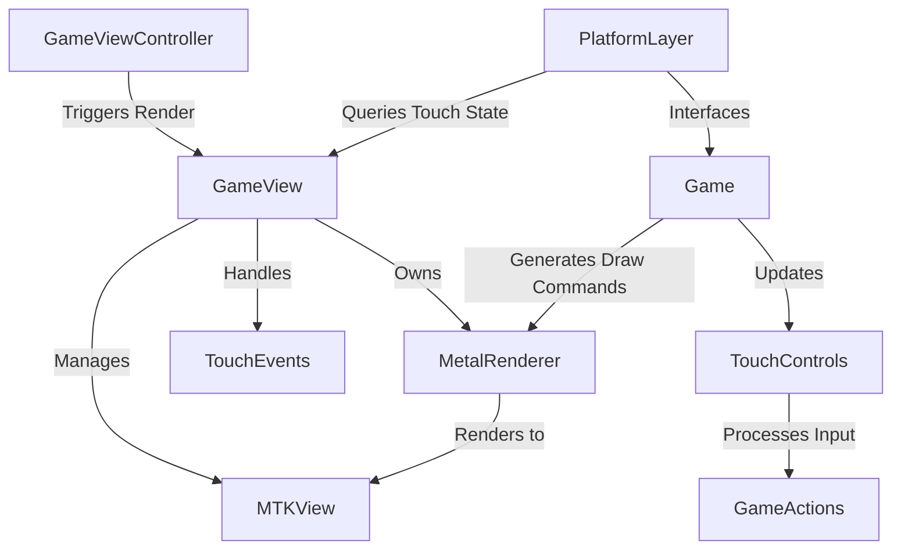

# Architecture Analysis for FloppyTurd Touch and Rendering System

## Current System Overview

The current architecture of the "FloppyTurd" game on iOS involves several components handling touch input and rendering, which have been partially refactored to centralize functionality in [`GameView`](FloppyTurd/iOS/GameView.mm). Below is a breakdown of the key components and their roles based on the latest codebase:

- **GameView**: Recently introduced to centralize touch input handling and rendering. It manages an MTKView for Metal rendering, owns a MetalRenderer instance, and tracks touch states for querying by other components.
- **GameViewController**: The top-level UIViewController that now uses GameView instead of directly managing MTKView. It forwards lifecycle events and previously handled touch events directly.
- **PlatformLayer**: A singleton that interfaces between the game logic and iOS-specific features. It currently queries GameView for touch states and holds some Metal rendering state (e.g., command queue, vertex buffers) that could be decoupled.
- **PlatformLayerDelegate**: Manages the MetalRenderer instance and acts as the MTKView delegate for rendering callbacks. It also forwards touch events to GameViewController, which is redundant post-refactor.
- **MetalRenderer**: Handles low-level Metal rendering operations, processing draw commands generated by the game loop.
- **TouchControls**: An instance-based class within Game for processing touch inputs into game actions (e.g., jump, shoot), updated by querying PlatformLayer.

### Current Flow of Touch Input
1. Touch events are received by GameView directly as it is a UIView subclass.
2. GameView updates internal touch state tracking.
3. PlatformLayer queries GameView for touch states during `UpdateTouchState()` and updates TouchControls.
4. TouchControls processes these states into game actions within the Game class's update loop.

### Current Flow of Rendering
1. GameViewController triggers rendering via GameView's `render` method during the game loop.
2. GameView delegates to MetalRenderer for actual rendering operations.
3. PlatformLayerDelegate, still set up to handle MTKView delegate callbacks in some configurations, forwards rendering tasks to MetalRenderer.
4. Game's `RenderFrame()` generates draw commands processed by MetalRenderer.

## Issues and Areas for Improvement

After analyzing the codebase, several areas can be improved to further decouple and organize the systems:

1. **Metal Rendering State in PlatformLayer**:
   - **Issue**: PlatformLayer currently holds static Metal rendering state (e.g., `s_CommandQueue`, `s_VertexBuffer`) which is not directly related to its role as a platform abstraction layer. This mixes concerns and complicates maintenance.
   - **Impact**: This coupling makes it harder to modify rendering logic without affecting platform abstraction, potentially leading to bugs or inefficiencies.

2. **Redundant Touch Event Forwarding in PlatformLayerDelegate**:
   - **Issue**: PlatformLayerDelegate forwards touch events to GameViewController, which is unnecessary since GameView now handles touch events directly.
   - **Impact**: This redundancy adds unnecessary complexity and potential points of failure in the touch input pipeline.

3. **PlatformLayerDelegate's Role in Rendering**:
   - **Issue**: PlatformLayerDelegate acts as an intermediary for rendering by managing MetalRenderer and responding to MTKView delegate callbacks, even though GameView is now the primary rendering hub.
   - **Impact**: This splits rendering responsibilities across multiple components, reducing clarity and making the system harder to debug or extend.

4. **Build and Test Verification**:
   - **Issue**: While files have been updated in CMakeLists.txt, the system has not been built or tested to confirm proper linking and compilation after the refactor.
   - **Impact**: Unverified changes risk introducing build errors or runtime issues, especially with Objective-C and Metal integration in a mixed C++ environment.

## Proposed Plan for Decoupling and Improvement

To address these issues and achieve a more modular and maintainable architecture, I propose the following plan:

1. **Move Metal Rendering State to GameView or MetalRenderer**:
   - **Action**: Relocate all Metal rendering state (e.g., command queue, vertex buffers) from PlatformLayer to GameView, as it already manages the MTKView and owns MetalRenderer. Alternatively, consider moving low-level state management directly into MetalRenderer for even tighter encapsulation.
   - **Benefit**: This decouples rendering concerns from platform abstraction, allowing PlatformLayer to focus solely on bridging game logic to iOS features (e.g., file system, input queries).
   - **Implementation**: Update [`FloppyTurd/PlatformLayer.mm`](FloppyTurd/PlatformLayer.mm) to remove static Metal state variables and methods like `GetMetalCommandQueue()`. Add these to [`FloppyTurd/iOS/GameView.mm`](FloppyTurd/iOS/GameView.mm) or [`FloppyTurd/MetalRenderer.mm`](FloppyTurd/MetalRenderer.mm), ensuring rendering operations are fully contained.

2. **Eliminate Redundant Touch Event Forwarding in PlatformLayerDelegate**:
   - **Action**: Remove touch event forwarding methods from PlatformLayerDelegate since GameView handles touch events directly.
   - **Benefit**: Simplifies the touch input pipeline, reducing overhead and potential sync issues.
   - **Implementation**: Update [`FloppyTurd/PlatformLayerDelegate.mm`](FloppyTurd/PlatformLayerDelegate.mm) to remove methods like `touchesBegan:withEvent:` and related forwarding logic, ensuring no duplicate touch handling occurs.

3. **Consolidate Rendering Responsibilities in GameView**:
   - **Action**: Make GameView the sole MTKView delegate, fully managing rendering callbacks and MetalRenderer interactions. Reconfigure PlatformLayerDelegate to be a lightweight bridge or eliminate its rendering role entirely if possible.
   - **Benefit**: Centralizes rendering logic in GameView, improving clarity and reducing dependency on PlatformLayerDelegate for rendering tasks.
   - **Implementation**: Update [`FloppyTurd/iOS/GameView.mm`](FloppyTurd/iOS/GameView.mm) to ensure it is the MTKView delegate (already set in current code). Modify [`FloppyTurd/PlatformLayerDelegate.mm`](FloppyTurd/PlatformLayerDelegate.mm) to remove MTKView delegate responsibilities and MetalRenderer management, potentially refactoring it to handle only platform-specific initialization if needed.

4. **Build and Test the Refactored System**:
   - **Action**: Execute a build command to compile the project for iOS, ensuring all new and modified files are included and linked correctly. Follow up with on-device testing to verify touch input and rendering functionality.
   - **Benefit**: Confirms the integrity of the refactor, catching any compilation or runtime issues early.
   - **Implementation**: Use a build command like `cmake --build . --config Debug` in the project directory, followed by deploying to an iOS simulator or device for testing. Add debug logging in GameView and MetalRenderer to trace rendering and touch state updates during testing.

## Mermaid Diagram of Proposed Architecture

Below is a simplified diagram of the proposed architecture after implementing the above changes, focusing on decoupling rendering and touch handling:

- **GameViewController**: Initiates rendering and lifecycle events.
- **GameView**: Central hub for touch input and rendering, managing MTKView and MetalRenderer.
- **PlatformLayer**: Queries touch states from GameView for game logic, no longer holds rendering state.
- **MetalRenderer**: Handles all Metal rendering operations, fully encapsulated.
- **TouchControls**: Processes touch input into game actions within Game.

## Next Steps

- **User Confirmation**: Review this analysis and proposed plan. Confirm if the decoupling strategy aligns with your vision, or suggest modifications to the approach.
- **Implementation Phase**: Upon approval, switch to Code mode to implement the changes outlined, starting with moving Metal rendering state to GameView or MetalRenderer, followed by removing redundant touch forwarding in PlatformLayerDelegate, and consolidating rendering in GameView.
- **Build and Test**: Execute build and test steps to ensure the system compiles and functions as expected on iOS devices.

This plan aims to enhance modularity, reduce coupling, and improve maintainability of the touch and rendering systems in "FloppyTurd". Please provide feedback on this analysis and proposed improvements.