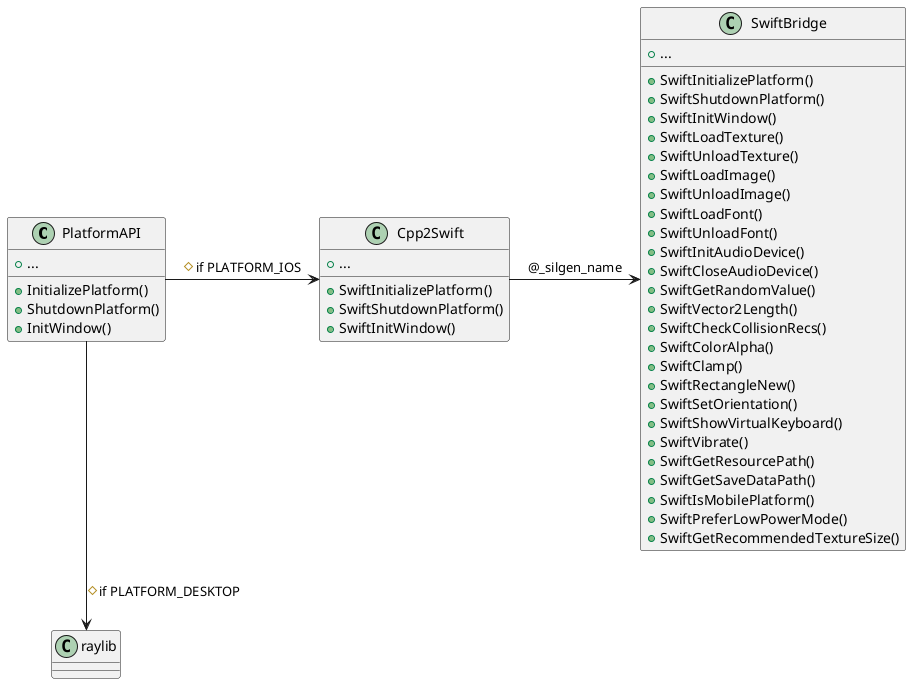

# FloppyTurd Platform Abstraction & Swift Bridge

## Overview

This project uses a robust, header-only C++ PlatformAPI abstraction, with a clean separation between iOS (bridged to Swift) and desktop (raylib) implementations. The iOS side uses a pure Swift bridge (no Objective-C), with all bridge functions consistently prefixed with `Swift`.

---

## Architecture

### Layered Flow

```plaintext
[C++ PlatformAPI.h]
   |--(PLATFORM_IOS)--> [Cpp2Swift Namespace] --(extern "C")--> [Swift @_silgen_name Functions]
   |--(PLATFORM_DESKTOP)--> [raylib Functions]

[Cpp2Swift Namespace]
   |---> C++/Swift Structs (Vector2, Rectangle, Color, Font)
   |---> All function calls prefixed with Swift

[Swift Bridge]
   |---> Swift Structs (matching C++)
   |---> Swift Functions (all prefixed Swift)
   |---> Subsystem Implementations (TODO: organize by subsystem)
```

---

## Struct Mapping

| C++ Type   | Swift Type   | Fields                |
|------------|--------------|-----------------------|
| Vector2    | Vector2      | float x, float y      |
| Rectangle  | Rectangle    | float x, y, w, h      |
| Color      | Color        | uint8 r, g, b, a      |
| Font       | Font         | uint32 id             |

---

## Struct Layout & Memory Compatibility

All C++ structs used in the bridge (e.g., `Vector2`, `Rectangle`, `Color`, `Font`) must have an identical layout in Swift. This means:

- Field order and types must match exactly.
- No padding or extra fields.
- Use `@_cdecl` or `@_silgen_name` for Swift functions to ensure C ABI compatibility.
- Use `UnsafePointer` and `UnsafeMutablePointer` for passing pointers between C++ and Swift.
- For enums, use explicit integer types (e.g., `enum : int32_t`).
- Always test struct round-tripping (C++ -> Swift -> C++) to verify memory compatibility.

Example:

```cpp
// C++
struct Vector2 { float x; float y; };
```

```swift
// Swift
struct Vector2 {
    var x: Float
    var y: Float
}
```

If you add or change a struct, update both C++ and Swift definitions and test thoroughly.

---

## Master Function Mapping Table

| Subsystem   | PlatformAPI.h Function         | Cpp2Swift Bridge Function         | Swift Function (`@_silgen_name`) | Status      |
|-------------|-------------------------------|-----------------------------------|----------------------------------|-------------|
| Platform    | InitializePlatform            | SwiftInitializePlatform           | SwiftInitializePlatform()        | Stub        |
| Platform    | ShutdownPlatform              | SwiftShutdownPlatform             | SwiftShutdownPlatform()          | Stub        |
| Platform    | Initialize                    | SwiftInitialize                   | SwiftInitialize(void*)           | Stub        |
| Platform    | Initialize (no args)          | SwiftInitializeDefault            | SwiftInitializeDefault()         | Stub        |
| Platform    | Shutdown                      | SwiftShutdown                     | SwiftShutdown()                  | Stub        |
| Window      | InitWindow                    | SwiftInitWindow                   | SwiftInitWindow(...)             | Stub        |
| Window      | CloseWindow                   | SwiftCloseWindow                  | SwiftCloseWindow()               | Stub        |
| Window      | WindowShouldClose             | SwiftWindowShouldClose            | SwiftWindowShouldClose()         | Stub        |
| Window      | GetScreenWidth                | SwiftGetScreenWidth               | SwiftGetScreenWidth()            | Stub        |
| Window      | GetScreenHeight               | SwiftGetScreenHeight              | SwiftGetScreenHeight()           | Stub        |
| Window      | GetScreenScale                | SwiftGetScreenScale               | SwiftGetScreenScale()            | Stub        |
| Window      | SetTargetFPS                  | SwiftSetTargetFPS                 | SwiftSetTargetFPS(Int32)         | Stub        |
| Window      | GetCurrentFPS                 | SwiftGetCurrentFPS                | SwiftGetCurrentFPS()             | Stub        |
| Window      | GetCurrentFrameTime           | SwiftGetCurrentFrameTime          | SwiftGetCurrentFrameTime()       | Stub        |
| Window      | SetWindowSize                 | SwiftSetWindowSize                | SwiftSetWindowSize(...)          | Stub        |
| Window      | ToggleFullscreen              | SwiftToggleFullscreen             | SwiftToggleFullscreen()          | Stub        |
| Window      | IsWindowFullscreen            | SwiftIsWindowFullscreen           | SwiftIsWindowFullscreen()        | Stub        |
| Window      | GetScreenCenter               | SwiftGetScreenCenter              | SwiftGetScreenCenter(...)        | Stub        |
| Window      | GetRenderScale                | SwiftGetRenderScale               | SwiftGetRenderScale(...)         | Stub        |
| Window      | GetSafeArea                   | SwiftGetSafeArea                  | SwiftGetSafeArea(...)            | Stub        |
| Window      | GetScreenDensity              | SwiftGetScreenDensity             | SwiftGetScreenDensity()          | Stub        |
| Window      | IsLandscape                   | SwiftIsLandscape                  | SwiftIsLandscape()               | Stub        |
| Window      | IsPortrait                    | SwiftIsPortrait                   | SwiftIsPortrait()                | Stub        |
| Window      | SetPreferredOrientation       | SwiftSetPreferredOrientation      | SwiftSetPreferredOrientation()   | Stub        |
| Window      | ShouldUseLargerTouchTargets   | SwiftShouldUseLargerTouchTargets  | SwiftShouldUseLargerTouchTargets()| Stub       |
| Window      | GetRecommendedFontSize        | SwiftGetRecommendedFontSize       | SwiftGetRecommendedFontSize()    | Stub        |
| Window      | UpdateSafeAreaInsets          | SwiftUpdateSafeAreaInsets         | SwiftUpdateSafeAreaInsets(...)   | Stub        |
| Input       | IsKeyPressed                  | SwiftIsKeyPressed                 | SwiftIsKeyPressed(Int32)         | Stub        |
| Input       | IsKeyDown                     | SwiftIsKeyDown                    | SwiftIsKeyDown(Int32)            | Stub        |
| Input       | IsKeyReleased                 | SwiftIsKeyReleased                | SwiftIsKeyReleased(Int32)        | Stub        |
| Input       | IsMouseButtonPressed          | SwiftIsMouseButtonPressed         | SwiftIsMouseButtonPressed(Int32) | Stub        |
| Input       | IsMouseButtonDown             | SwiftIsMouseButtonDown            | SwiftIsMouseButtonDown(Int32)    | Stub        |
| Input       | IsMouseButtonReleased         | SwiftIsMouseButtonReleased        | SwiftIsMouseButtonReleased(Int32)| Stub        |
| Input       | GetMousePosition              | SwiftGetMousePosition             | SwiftGetMousePosition()          | Stub        |
| Input       | GetMouseDelta                 | SwiftGetMouseDelta                | SwiftGetMouseDelta()             | Stub        |
| Input       | GetTouchPosition              | SwiftGetTouchPosition             | SwiftGetTouchPosition(Int32)     | Stub        |
| Input       | IsPrimaryInputPressed         | SwiftIsPrimaryInputPressed        | SwiftIsPrimaryInputPressed()     | Stub        |
| Input       | IsPrimaryInputDown            | SwiftIsPrimaryInputDown           | SwiftIsPrimaryInputDown()        | Stub        |
| Input       | IsPrimaryInputReleased        | SwiftIsPrimaryInputReleased       | SwiftIsPrimaryInputReleased()    | Stub        |
| Input       | GetPrimaryInputPosition       | SwiftGetPrimaryInputPosition      | SwiftGetPrimaryInputPosition()   | Stub        |
| Rendering   | BeginDrawing                  | SwiftBeginDrawing                 | SwiftBeginDrawing()              | Stub        |
| Rendering   | EndDrawing                    | SwiftEndDrawing                   | SwiftEndDrawing()                | Stub        |
| Rendering   | ClearBackground               | SwiftClearBackground              | SwiftClearBackground(Color)      | Stub        |
| Rendering   | DrawRectangle                 | SwiftDrawRectangle                | SwiftDrawRectangle(...)          | Stub        |
| Rendering   | DrawRectangleRec              | SwiftDrawRectangleRec             | SwiftDrawRectangleRec(...)       | Stub        |
| Rendering   | DrawRectangleLinesEx          | SwiftDrawRectangleLinesEx         | SwiftDrawRectangleLinesEx(...)   | Stub        |
| Rendering   | DrawRectangleRounded          | SwiftDrawRectangleRounded         | SwiftDrawRectangleRounded(...)   | Stub        |
| Rendering   | DrawCircle                    | SwiftDrawCircle                   | SwiftDrawCircle(...)             | Stub        |
| Rendering   | DrawCircleV                   | SwiftDrawCircleV                  | SwiftDrawCircleV(...)            | Stub        |
| Rendering   | DrawLine                      | SwiftDrawLine                     | SwiftDrawLine(...)               | Stub        |
| Rendering   | DrawLineV                     | SwiftDrawLineV                    | SwiftDrawLineV(...)              | Stub        |
| Rendering   | DrawLineEx                    | SwiftDrawLineEx                   | SwiftDrawLineEx(...)             | Stub        |
| Rendering   | DrawText                      | SwiftDrawText                     | SwiftDrawText(...)               | Stub        |
| Rendering   | DrawTextEx                    | SwiftDrawTextEx                   | SwiftDrawTextEx(...)             | Stub        |
| Rendering   | BeginScissorMode              | SwiftBeginScissorMode             | SwiftBeginScissorMode(...)       | Stub        |
| Rendering   | EndScissorMode                | SwiftEndScissorMode               | SwiftEndScissorMode()            | Stub        |
| Rendering   | DrawFPS                       | SwiftDrawFPS                      | SwiftDrawFPS(...)                | Stub        |
| UI          | InitializeUIManager           | InitializeUIManager               | (C++ only, not bridged)          | Implemented |

| Texture      | LoadTexture                    | SwiftLoadTexture                  | SwiftLoadTexture(...)            | Stub        |
| Texture      | UnloadTexture                  | SwiftUnloadTexture                | SwiftUnloadTexture(...)          | Stub        |
| Texture      | LoadImage                      | SwiftLoadImage                    | SwiftLoadImage(...)              | Stub        |
| Texture      | UnloadImage                    | SwiftUnloadImage                  | SwiftUnloadImage(...)            | Stub        |
| Texture      | SetTextureWrap                 | SwiftSetTextureWrap               | SwiftSetTextureWrap(...)         | Stub        |
| Texture      | LoadTextureFromImage           | SwiftLoadTextureFromImage         | SwiftLoadTextureFromImage(...)   | Stub        |
| Texture      | DrawTexture                    | SwiftDrawTexture                  | SwiftDrawTexture(...)            | Stub        |
| Texture      | DrawTextureV                   | SwiftDrawTextureV                 | SwiftDrawTextureV(...)           | Stub        |
| Texture      | DrawTextureRec                 | SwiftDrawTextureRec               | SwiftDrawTextureRec(...)         | Stub        |
| Texture      | DrawTexturePro                 | SwiftDrawTexturePro               | SwiftDrawTexturePro(...)         | Stub        |
| Texture      | DrawTextureEx                  | SwiftDrawTextureEx                | SwiftDrawTextureEx(...)          | Stub        |
| Texture      | SetTextureFilter               | SwiftSetTextureFilter             | SwiftSetTextureFilter(...)       | Stub        |

| Font         | LoadFont                       | SwiftLoadFont                     | SwiftLoadFont(...)               | Stub        |
| Font         | LoadFontEx                     | SwiftLoadFontEx                   | SwiftLoadFontEx(...)             | Stub        |
| Font         | UnloadFont                     | SwiftUnloadFont                   | SwiftUnloadFont(...)             | Stub        |
| Font         | MeasureText                    | SwiftMeasureText                  | SwiftMeasureText(...)            | Stub        |
| Font         | MeasureTextEx                  | SwiftMeasureTextEx                | SwiftMeasureTextEx(...)          | Stub        |
| Font         | GetFontDefault                 | SwiftGetFontDefault               | SwiftGetFontDefault()            | Stub        |

| Audio        | InitAudioDevice                | SwiftInitAudioDevice              | SwiftInitAudioDevice()           | Stub        |
| Audio        | CloseAudioDevice               | SwiftCloseAudioDevice             | SwiftCloseAudioDevice()          | Stub        |
| Audio        | IsAudioDeviceReady             | SwiftIsAudioDeviceReady           | SwiftIsAudioDeviceReady()        | Stub        |
| Audio        | SetMasterVolume                | SwiftSetMasterVolume              | SwiftSetMasterVolume(...)        | Stub        |
| Audio        | LoadSound                      | SwiftLoadSound                    | SwiftLoadSound(...)              | Stub        |
| Audio        | PlaySound                      | SwiftPlaySound                    | SwiftPlaySound(...)              | Stub        |
| Audio        | StopSound                      | SwiftStopSound                    | SwiftStopSound(...)              | Stub        |
| Audio        | PauseSound                     | SwiftPauseSound                   | SwiftPauseSound(...)             | Stub        |
| Audio        | ResumeSound                    | SwiftResumeSound                  | SwiftResumeSound(...)            | Stub        |
| Audio        | SetSoundVolume                 | SwiftSetSoundVolume               | SwiftSetSoundVolume(...)         | Stub        |
| Audio        | SetSoundPitch                  | SwiftSetSoundPitch                | SwiftSetSoundPitch(...)          | Stub        |
| Audio        | SetSoundPan                    | SwiftSetSoundPan                  | SwiftSetSoundPan(...)            | Stub        |
| Audio        | IsSoundPlaying                 | SwiftIsSoundPlaying               | SwiftIsSoundPlaying(...)         | Stub        |
| Audio        | UnloadSound                    | SwiftUnloadSound                  | SwiftUnloadSound(...)            | Stub        |
| Audio        | LoadMusicStream                | SwiftLoadMusicStream              | SwiftLoadMusicStream(...)        | Stub        |
| Audio        | LoadMusic                      | SwiftLoadMusic                    | SwiftLoadMusic(...)              | Stub        |
| Audio        | PlayMusicStream                | SwiftPlayMusicStream              | SwiftPlayMusicStream(...)        | Stub        |
| Audio        | PlayMusic                      | SwiftPlayMusic                    | SwiftPlayMusic(...)              | Stub        |
| Audio        | StopMusicStream                | SwiftStopMusicStream              | SwiftStopMusicStream(...)        | Stub        |
| Audio        | StopMusic                      | SwiftStopMusic                    | SwiftStopMusic()                 | Stub        |
| Audio        | PauseMusicStream               | SwiftPauseMusicStream             | SwiftPauseMusicStream(...)       | Stub        |
| Audio        | ResumeMusicStream              | SwiftResumeMusicStream            | SwiftResumeMusicStream(...)      | Stub        |
| Audio        | UpdateMusicStream              | SwiftUpdateMusicStream            | SwiftUpdateMusicStream(...)      | Stub        |
| Audio        | SetMusicVolume                 | SwiftSetMusicVolume               | SwiftSetMusicVolume(...)         | Stub        |
| Audio        | SetMusicVolumeForId            | SwiftSetMusicVolumeForId          | SwiftSetMusicVolumeForId(...)    | Stub        |
| Audio        | IsMusicStreamPlaying           | SwiftIsMusicStreamPlaying         | SwiftIsMusicStreamPlaying(...)   | Stub        |
| Audio        | IsMusicPlaying                 | SwiftIsMusicPlaying               | SwiftIsMusicPlaying()            | Stub        |
| Audio        | SetMusicLooping                | SwiftSetMusicLooping              | SwiftSetMusicLooping(...)        | Stub        |
| Audio        | GetMusicTimeLength             | SwiftGetMusicTimeLength           | SwiftGetMusicTimeLength(...)     | Stub        |
| Audio        | GetMusicTimePlayed             | SwiftGetMusicTimePlayed           | SwiftGetMusicTimePlayed(...)     | Stub        |
| Audio        | UnloadMusicStream              | SwiftUnloadMusicStream            | SwiftUnloadMusicStream(...)      | Stub        |
| Audio        | UnloadMusic                    | SwiftUnloadMusic                  | SwiftUnloadMusic(...)            | Stub        |

| Time         | GetTime                        | SwiftGetTime                      | SwiftGetTime()                   | Stub        |
| Time         | GetFrameTime                   | SwiftGetFrameTime                 | SwiftGetFrameTime()              | Stub        |

| Math/Util    | GetRandomValue                 | SwiftGetRandomValue               | SwiftGetRandomValue(...)         | Stub        |
| Math/Util    | GetRandomFloat                 | SwiftGetRandomFloat               | SwiftGetRandomFloat(...)         | Stub        |
| Math/Util    | SetRandomSeed                  | SwiftSetRandomSeed                | SwiftSetRandomSeed(...)          | Stub        |
| Math/Util    | GetRandomVector2               | SwiftGetRandomVector2             | SwiftGetRandomVector2(...)       | Stub        |
| Math/Util    | GetRandomColor                 | SwiftGetRandomColor               | SwiftGetRandomColor()            | Stub        |
| Math/Util    | TraceLog                       | SwiftTraceLog                     | SwiftTraceLog(...)               | Stub        |
| Math/Util    | SetTraceLogLevel               | SwiftSetTraceLogLevel             | SwiftSetTraceLogLevel(...)       | Stub        |
| Math/Util    | SetConfigFlags                 | SwiftSetConfigFlags               | SwiftSetConfigFlags(...)         | Stub        |

| VectorMath   | Vector2Length                  | SwiftVector2Length                | SwiftVector2Length(...)          | Stub        |
| VectorMath   | Vector2Normalize               | SwiftVector2Normalize             | SwiftVector2Normalize(...)       | Stub        |
| VectorMath   | Vector2Add                     | SwiftVector2Add                   | SwiftVector2Add(...)             | Stub        |
| VectorMath   | Vector2Subtract                | SwiftVector2Subtract              | SwiftVector2Subtract(...)        | Stub        |
| VectorMath   | Vector2Scale                   | SwiftVector2Scale                 | SwiftVector2Scale(...)           | Stub        |
| VectorMath   | Vector2Distance                | SwiftVector2Distance              | SwiftVector2Distance(...)        | Stub        |

| Collision    | CheckCollisionRecs             | SwiftCheckCollisionRecs           | SwiftCheckCollisionRecs(...)     | Stub        |
| Collision    | CheckCollisionCircleRec        | SwiftCheckCollisionCircleRec      | SwiftCheckCollisionCircleRec(...)| Stub        |
| Collision    | CheckCollisionPointRec         | SwiftCheckCollisionPointRec       | SwiftCheckCollisionPointRec(...) | Stub        |

| Color        | ColorAlpha                     | SwiftColorAlpha                   | SwiftColorAlpha(...)             | Stub        |
| Color        | Fade                           | SwiftFade                         | SwiftFade(...)                   | Stub        |
| Color        | ColorLerp                      | SwiftColorLerp                    | SwiftColorLerp(...)              | Stub        |

| MathUtil     | Clamp                          | SwiftClamp                        | SwiftClamp(...)                  | Stub        |
| MathUtil     | Lerp                           | SwiftLerp                         | SwiftLerp(...)                   | Stub        |

| RectUtil     | RectangleNew                   | SwiftRectangleNew                 | SwiftRectangleNew(...)           | Stub        |

| Platform     | SetOrientation                 | SwiftSetOrientation               | SwiftSetOrientation(...)         | Stub        |
| Platform     | ShowVirtualKeyboard            | SwiftShowVirtualKeyboard          | SwiftShowVirtualKeyboard(...)    | Stub        |
| Platform     | Vibrate                        | SwiftVibrate                      | SwiftVibrate(...)                | Stub        |
| Platform     | GetResourcePath                | SwiftGetResourcePath              | SwiftGetResourcePath(...)        | Stub        |
| Platform     | GetSaveDataPath                | SwiftGetSaveDataPath              | SwiftGetSaveDataPath(...)        | Stub        |
| Platform     | IsMobilePlatform               | SwiftIsMobilePlatform             | SwiftIsMobilePlatform()          | Stub        |
| Platform     | PreferLowPowerMode             | SwiftPreferLowPowerMode           | SwiftPreferLowPowerMode()        | Stub        |
| Platform     | GetRecommendedTextureSize      | SwiftGetRecommendedTextureSize    | SwiftGetRecommendedTextureSize() | Stub        |

---

## UML Diagram (PlantUML)



---

## How to Extend

1. **Add new platform functions** to `PlatformAPI.h` and the `Cpp2Swift` namespace.
2. **Declare the corresponding Swift function** in `CppInteropBridgeSwift.swift` with `@_silgen_name("Swift...")`.
3. **Implement the Swift function** (even as a stub with a log).
4. **Update the mapping table and README**.
5. **Test the bridge** with a simple call/log.

---

## Implementation Status

- [x] All bridge functions declared and stubbed
- [ ] All functions implemented in Swift
- [ ] Subsystems organized in Swift
- [ ] Error handling/logging for unimplemented features

---

## Next Steps

1. **Fill in any missing functions** in the mapping table.
2. **Implement or stub all Swift bridge functions.**
3. **Organize Swift bridge by subsystem.**
4. **Add error handling/logging.**
5. **Keep this README and UML up to date as you extend the bridge.**

---
