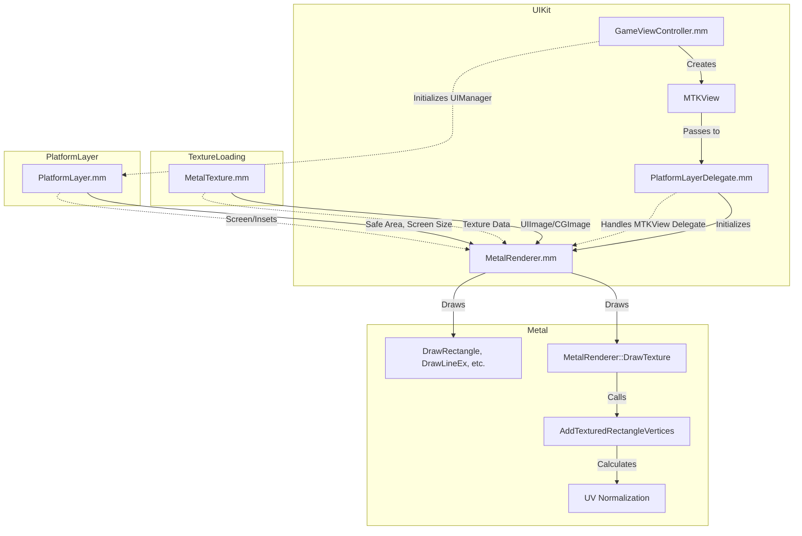

# Known Issues (as of July 7, 2025)

- **Main Menu Background Cutoff:**
  - The main menu background texture does not fill the entire screen as intended; it is cut off or misaligned.
- **Logo Texture Cutoff:**
  - The Floppy Turd logo is either missing, cut off, or not positioned/scaled as expected.
- **Text Rendering Failures:**
  - UI text (button labels, etc.) is still not rendering correctly—often upside down, mirrored, or missing.
- **General UI Predictability:**
  - The system is not yet robust or reliably predictable in where and how much of the screen images/textures take up. Pixel-accurate, device-independent layout is not guaranteed.

---

# FloppyTurd iOS: UIKit/Metal & UV Coordinate System Analysis

## 1. UV Calculation in MetalRenderer
- **File:** `MetalRenderer.mm`
- **Function:** `AddTexturedRectangleVertices(Rectangle dest, Rectangle source, Color tint)`
    - UVs are normalized by dividing the source rect by the current texture's width/height:
      ```cpp
      float u1 = source.x / texWidth;
      float v1 = source.y / texHeight;
      float u2 = (source.x + source.width) / texWidth;
      float v2 = (source.y + source.height) / texHeight;
      ```
    - Vertices are then created for two triangles using these UVs.
    - **Potential Issue:** If `texWidth`/`texHeight` or `source` are not what you expect, UVs will be wrong.

## 2. UIKit/Metal Transition Points
- **UIKit Setup:**
    - `GameViewController.mm` creates the `MTKView` and sets up the Metal device.
    - `PlatformLayerDelegate.mm` initializes `MetalRenderer` with the `MTKView`.
    - `PlatformLayer.mm` and `UIManager` provide safe area and screen size info (from UIKit) to the renderer.
- **Metal Rendering:**
    - All draw calls (background, logo, UI) go through `MetalRenderer`.
    - Textures are loaded via `MetalTexture.mm` (using UIKit's `UIImage`/`CGImage`).

## 3. File Map for Deep Dive
- **UIKit/Platform Layer:**
    - `GameViewController.mm` (UIKit, MTKView, screen/safe area)
    - `PlatformLayer.mm` (UIKit, safe area, screen size, Metal init)
    - `PlatformLayerDelegate.mm` (MTKView delegate, MetalRenderer init)
    - `UIManager.h/.cpp` (safe area, screen size, scale)
- **Metal/Rendering:**
    - `MetalRenderer.mm/.h` (all draw calls, UVs, projection matrix)
    - `MetalTexture.mm/.h` (texture loading, UIKit/CGImage bridge)
    - `MetalFrameResources.mm/.h` (buffer management)
- **Shaders:**
    - `Shaders2D.metal` (vertex/fragment shaders, NDC mapping)

## 4. Mermaid Diagram



## 5. Checklist for Deep Dive
- [ ] Confirm `AddTexturedRectangleVertices` is always called with correct `source` and `dest` rects
- [ ] Confirm `texWidth`/`texHeight` match the actual Metal texture size
- [ ] Check all UIKit-to-Metal transitions for coordinate system mismatches (points vs pixels, y-flip)
- [ ] Review projection matrix setup in `MetalRenderer` (`SetProjectionMatrix`, `MakeOrthoMatrix`)
- [ ] Inspect `Shaders2D.metal` for NDC mapping and y-flip
- [ ] Check all texture loading in `MetalTexture.mm` for correct orientation and size
- [ ] Audit all uses of safe area and screen size in `UIManager` and `PlatformLayer`

---

**Next Steps:**
- Use this file as a living doc for debugging coordinate/UV issues.
- Mark off checklist items as you confirm or fix them. 