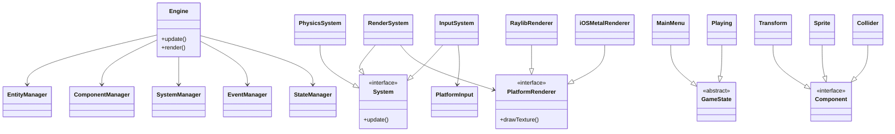

# New Gnosis UML Design: Integrating Missing Features with C++/Swift Interop

## Overview
This UML design combines the core Gnosis architecture from `GnosisUML.md` with the missing functionalities identified in `MISSING_FUNCTIONALITY_REPORT.md`. It emphasizes a robust, cohesive, and platform-agnostic structure, leveraging Apple's Swift-C++ interoperability best practices <mcreference link="https://www.swift.org/documentation/cxx-interop/" index="1">1</mcreference> <mcreference link="https://developer.apple.com/videos/play/wwdc2023/10172/" index="2">2</mcreference>. The design avoids past mistakes by minimizing unnecessary layers like platform traits, allowing managers to directly interface with platform-specific implementations via abstract interfaces or C++ templates for efficiency.

Key Principles:
- **Agnostic Core**: Central ECS in C++ remains platform-independent.
- **Interop Strategy**: Use Swift's C++ interop for bidirectional calls, annotations like SWIFT_SHARED_REFERENCE for shared types, and module maps for seamless integration <mcreference link="https://www.swift.org/documentation/cxx-interop/" index="1">1</mcreference>.
- **No Unnecessary Traits**: Managers (e.g., RenderSystem) use polymorphic interfaces to reach iOS (Swift/Metal) or Raylib sides directly, reducing overhead.
- **Directory Structure**: Follow proposed src/ layout with Engine/, iOS/, Raylib/, FloppyTurd/.

## Core Components (From Gnosis + Missing)

### Engine Core (C++)
- **Engine**: Orchestrates managers (Entity, Component, System, Event, State).
- **EntityManager**: Manages entity creation/destruction.
- **ComponentManager**: Handles components like Transform, Sprite, Collider, Camera, Score.
- **SystemManager**: Registers systems (Render, Physics, Input, Audio).
- **EventManager**: Dispatches events (e.g., InputAction, Collision).
- **StateManager**: Manages GameState hierarchy (MainMenu, Playing, Pause).

Integrated Missing Features:
- Modern Components: Transform, Sprite, Collider, Camera, Score.
- Systems: RenderSystem, PhysicsSystem, InputSystem, UISystem.
- Event-Driven: Full event system for decoupling.
- Data-Oriented: Optimize Component storage.

### Platform-Agnostic Interfaces (C++)
Abstract classes for platform-specific behaviors, implemented in Raylib or iOS layers.
- **PlatformRenderer**: Abstract for drawing (e.g., DrawTexture, DrawText).
- **PlatformInput**: Handles inputs (touch/mouse/keyboard).
- **PlatformAudio**: Manages sounds/music.

No platform traits needed; systems query the active platform implementation at runtime or via templates.

### iOS-Specific (Swift with C++ Interop)
- Uses Metal for rendering, AVFoundation for audio.
- CppInteropBridge: Lightweight bridge with C-style interfaces, annotated for Swift safety <mcreference link="https://www.swift.org/documentation/cxx-interop/status/" index="3">3</mcreference>.
- Managers reach iOS via bridge calls, e.g., InputSystem calls Swift touch handlers.

### Raylib-Specific (C++)
- Direct Raylib calls for desktop.
- Implements abstract interfaces.

### FloppyTurd Game Logic (C++)
- Entities: Player (Bird), Obstacles, Pickups (Hat, Skill, Coin).
- Levels: Park, Desert, etc., with bosses.
- Mechanics: Gravity, collisions, scoring, power-ups.

## UML Diagram (Mermaid Syntax)

## Interop Best Practices
- Enable interop in Xcode <mcreference link="https://developer.apple.com/videos/play/wwdc2023/10172/" index="2">2</mcreference>.
- Use shared references for C++ classes exposed to Swift <mcreference link="https://www.swift.org/documentation/cxx-interop/" index="1">1</mcreference>.
- Avoid direct C++ exposure in Swift; use bridges for safety.
- For cross-platform: Abstract factories select Raylib or iOS impl at compile-time.

This is our starting point—let's iterate to polish this turd!