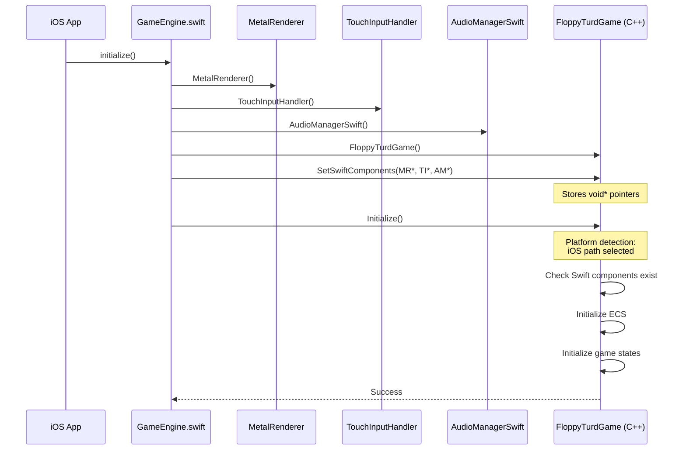
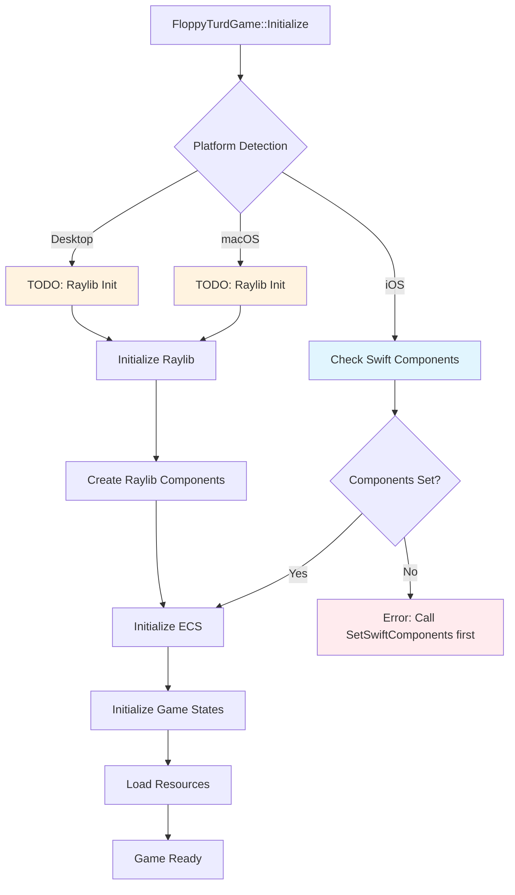
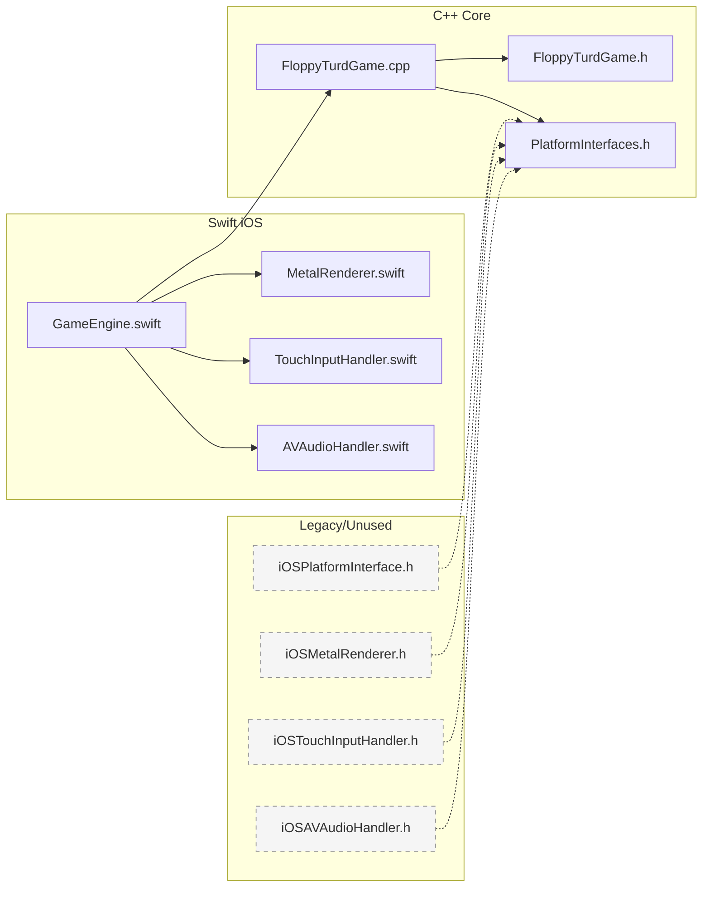

# Floppy Turd - System Architecture UML Diagram

## Current System State (Visual Representation)

### Class Diagram - Current Implementation

```mermaid
classDiagram
    class FloppyTurdGame {
        -m_ecsSystem: unique_ptr~ECS~
        -m_stateManager: unique_ptr~GameStateManager~
        -m_swiftMetalRenderer: void* (iOS only)
        -m_swiftTouchInputHandler: void* (iOS only)
        -m_swiftAudioHandler: void* (iOS only)
        -m_initialized: bool
        -m_running: bool
        +Initialize(): bool
        +SetSwiftComponents(void*, void*, void*): void
        +Update(float): void
        +Render(): void
        +Shutdown(): void
    }

    class GameEngine_Swift {
        -metalRenderer: MetalRenderer
        -touchInputHandler: TouchInputHandler
        -audioHandler: AudioManagerSwift
        -cppGame: FloppyTurdGame?
        +initialize(): void
        +update(): void
        +render(): void
    }

    class MetalRenderer_Swift {
        +beginFrame(): void
        +endFrame(): void
        +clearScreen(): void
        +drawSprite(): void
    }

    class TouchInputHandler_Swift {
        +pollEvents(): void
        +isActionPressed(): bool
        +getTouchPosition(): CGPoint
    }

    class AudioManagerSwift {
        +playSound(): void
        +playMusic(): void
        +setVolume(): void
    }

    %% Legacy/Unused Classes (Shown in gray)
    class IPlatform {
        <<interface>>
        +GetRenderer(): IRenderer*
        +GetInputHandler(): IInputHandler*
        +GetAudioHandler(): IAudioHandler*
    }
    
    class IRenderer {
        <<interface>>
        +BeginFrame(): void
        +EndFrame(): void
        +ClearScreen(): void
    }
    
    class IInputHandler {
        <<interface>>
        +PollEvents(): void
        +IsActionPressed(): bool
    }
    
    class IAudioHandler {
        <<interface>>
        +PlaySound(): void
        +PlayMusic(): void
    }

    %% Relationships
    GameEngine_Swift --> FloppyTurdGame : "creates and manages"
    GameEngine_Swift --> MetalRenderer_Swift : "owns"
    GameEngine_Swift --> TouchInputHandler_Swift : "owns"
    GameEngine_Swift --> AudioManagerSwift : "owns"
    
    FloppyTurdGame ..> MetalRenderer_Swift : "void* pointer"
    FloppyTurdGame ..> TouchInputHandler_Swift : "void* pointer"
    FloppyTurdGame ..> AudioManagerSwift : "void* pointer"
    
    %% Legacy relationships (dashed - unused)
    IPlatform -.-> IRenderer : "provides"
    IPlatform -.-> IInputHandler : "provides"
    IPlatform -.-> IAudioHandler : "provides"
```

### Sequence Diagram - Current iOS Initialization



### Component Architecture - Platform Branching



### File Dependency Graph - Current State



## Architecture Issues Identified

### 1. Mixed Paradigms
- **Active**: Direct Swift interop via void* pointers
- **Legacy**: IPlatform interface system (included but unused)
- **Problem**: Confusion about which approach to use

### 2. Incomplete Platform Support
- **iOS**: Partially implemented with Swift components
- **macOS/Desktop**: TODO placeholders for Raylib
- **Problem**: No clear path for non-iOS platforms

### 3. Compilation Issues
- References to removed `m_platform` members
- Unused includes causing potential conflicts
- Missing `std::make_unique` includes

### 4. Architectural Debt
- Legacy C++ wrapper headers exist but unused
- Unclear file purposes and dependencies
- Mixed initialization patterns

## Recommended Resolution Path

### Option A: Pure Direct Interop
```
✅ Remove all IPlatform interfaces
✅ iOS: Direct Swift 5.9+ interop
✅ macOS/Desktop: Direct Raylib calls
✅ Platform-specific code in FloppyTurdGame
```

### Option B: Hybrid Approach
```
✅ Keep minimal IPlatform for abstraction
✅ iOS: Swift components behind thin C++ wrappers
✅ macOS/Desktop: Raylib behind thin C++ wrappers
✅ Consistent interface for FloppyTurdGame
```

### Option C: Full Abstraction
```
✅ Robust IPlatform system
✅ All platforms behind consistent interfaces
✅ More complex but fully abstracted
✅ Future-proof for additional platforms
```

## Decision Required

We need to choose one approach and commit to it fully. The current mixed state is causing confusion and compilation issues. Each option has trade-offs in complexity vs. abstraction vs. performance.