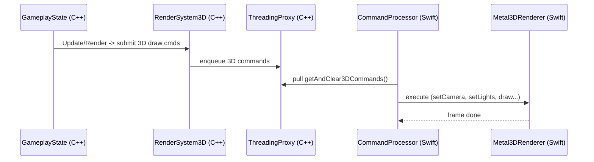

## 3D Engine Fork Proposal - Modular ECS-Aligned Architecture

Goals:
- Keep renderer small and modular; avoid bloat via clear interfaces and render passes
- Reuse current ECS, states, platform delegates model; add 3D components/systems
- iOS-first with `Metal3DRenderer (Swift)`, future `Raylib3D` backend

### High-Level 3D Architecture (alongside existing 2D)

```mermaid
graph TD
  subgraph "Game (C++)"
    FTG["GameCore::FloppyTurdGame (unchanged)"]
    GSM["GameCore::GameStateManager"]
    ECS["Gnosis::ECS"]
    SM["Gnosis::SystemManager (orchestrator)"]
  end

  subgraph "3D Systems (C++)"
    SG["GameCore3D::SceneGraphSystem"]
    RS3D["GameCore3D::RenderSystem3D"]
    AN3D["GameCore3D::AnimationSystem3D (skeletal)"]
    AUD3D["GameCore3D::AudioSystem3D (spatial)"]
    IN3D["GameCore3D::InputSystem3D (FP controls)"]
    NET3D["GameCore3D::NetworkingSystem"]
    DIAG3D["GameCore3D::DiagnosticsSystem"]
    PHY3D["GameCore3D::PhysicsSystem3D (future)"]
  end

  subgraph "3D Components (C++)"
    T3D["Transform3D {position: vec3, rotation: quat, scale: vec3}"]
    HIER["Hierarchy {parent: Entity, firstChild, nextSibling}"]
    C3D["Camera3D {fov, aspect, near, far, projection}"]
    L3D["Light {type, color, intensity, range, angle}"]
    MR3D["MeshRenderer {mesh, material}"]
    SMR["SkinnedMeshRenderer {mesh, material, skeleton}"]
    MAT["Material {shader, textures, params}"]
    SKY["Skybox {cubemap}"]
    PBDY["PhysicsBody3D {mass, drag, kinematic, velocity: vec3, angularVel: vec3}"]
    COL3D["Collider3D {box/sphere/capsule/mesh}"]
    AUDSRC["AudioSource3D {soundId, volume, falloff, spatialBlend, doppler, loop, playOnStart}"]
    NSYNC["NetworkSync {ownerId, predictionMode, syncFrequency}"]
  end

  subgraph "Platform Delegates (C++)"
    PDL["GameCore::PlatformDelegates\n+RendererDelegate + Renderer3DDelegate\n+Input3DDelegate + Audio3DDelegate\n+NetworkDelegate + DiagnosticsDelegate\n+AssetDelegate (extended)"]
  end

  subgraph "iOS (Swift)"
    GE["GameEngine (Swift)"]
    CP["CommandProcessor (Swift)"]
    M3D["Metal3DRenderer (Swift)"]
    TPX["ThreadingProxy (C++)"]
  end

  subgraph "Raylib 3D (C++)"
    RL3D["RaylibRenderer3D"]
  end

  FTG --> ECS
  ECS --> SM
  SM --> SG
  SM --> RS3D
  SM --> AN3D
  SM -.future.-> PHY3D

  SG --> T3D
  SG --> HIER
  RS3D --> T3D
  RS3D --> C3D
  RS3D --> L3D
  RS3D --> MR3D
  RS3D --> SMR
  RS3D --> MAT
  RS3D --> SKY
  AUD3D --> AUDSRC
  IN3D --> T3D
  NET3D --> NSYNC

  PDL -.3D calls.-> RS3D
  CP --> TPX
  TPX -.3D command buffers.-> M3D
  PDL -.3D calls.-> RL3D
  GE --> CP
  GE --> FTG
```



### Renderer3D Abstractions

```mermaid
classDiagram
  class "IRenderer3D (C++)" {
    <<interface>>
    + Initialize()
    + Shutdown()
    + BeginFrame()/EndFrame()/Present()
    + SetCamera(camera: CameraParams)
    + SetLights(lights: array<LightParams>)
    + CreateMesh(verts, indices, layout) -> MeshHandle
    + DestroyMesh(MeshHandle)
    + CreateMaterial(desc) -> MaterialHandle
    + DestroyMaterial(MaterialHandle)
    + DrawMesh(mesh, transform, material)
    + DrawSkinnedMesh(mesh, transform, material, skeleton)
    + DrawSkybox(cubemap)
    + BatchDraws(buffer: CommandBuffer)
  }
  class "RenderPass" { <<abstract>> + Execute(ctx) }
  class "ForwardPass" { + Execute(ctx) }
  class "ShadowPass" { + Execute(ctx) }
  class "SkyboxPass" { + Execute(ctx) }
  class "UIOverlayPass (2D)" { + Execute(ctx) }
  class "RenderPipeline" { - passes: vector<RenderPass*> + AddPass(p) + ExecuteAll(ctx) }

  class "Metal3DRenderer (Swift)" {
    + beginFrame()/endFrame()/present()
    + setCamera()/setLights()
    + registerMesh()/destroyMesh()
    + registerMaterial()/destroyMaterial()
    + drawMesh()/drawSkinnedMesh()/drawSkybox()
    + batchCommands(buffer)
  }
  class "RaylibRenderer3D (C++)" {
    + BeginFrame()/EndFrame()/Present()
    + SetCamera()/SetLights()
    + CreateMesh()/DestroyMesh()
    + DrawMesh()/DrawSkybox()
    + BatchDraws(buffer)
  }

  IRenderer3D <|.. "Metal3DRenderer (Swift)": via delegates/commands
  IRenderer3D <|.. "RaylibRenderer3D (C++)"
  "RenderPipeline" o--> "RenderPass"
  "ForwardPass" --|> "RenderPass"
  "ShadowPass" --|> "RenderPass"
  "SkyboxPass" --|> "RenderPass"
  "UIOverlayPass (2D)" --|> "RenderPass"
```

Design note: keep renderer slim by pushing policy to `RenderPipeline` and discrete `RenderPass`es. ECS systems emit high-level draw intents; render backend handles only submission.

### 3D Components and Systems

```mermaid
classDiagram
  class "GameCore3D::Transform3D" { position: vec3; rotation: quat; scale: vec3 }
  class "GameCore3D::Hierarchy" { parent: Entity; firstChild: Entity; nextSibling: Entity }
  class "GameCore3D::Camera3D" { fov; aspect; near; far; projection }
  class "GameCore3D::Light" { type: enum; color: vec3; intensity: float; range: float; angle: float }
  class "GameCore3D::MeshRenderer" { mesh: MeshHandle; material: MaterialHandle }
  class "GameCore3D::SkinnedMeshRenderer" { mesh; material; skeleton: SkeletonHandle }
  class "GameCore3D::Material" { shader: ShaderHandle; textures: map; params: map }
  class "GameCore3D::Skybox" { cubemap: TextureHandle }
  class "GameCore3D::SceneGraphSystem" { + UpdateWorldTransforms() }
  class "GameCore3D::RenderSystem3D" { + CollectVisible() + SubmitDraws() }
  class "GameCore3D::AnimationSystem3D" { + UpdateSkeletalAnimation() }
  class "GameCore3D::PhysicsSystem3D" { + StepSimulation() }

  "GameCore3D::SceneGraphSystem" ..> "GameCore3D::Transform3D"
  "GameCore3D::RenderSystem3D" ..> "GameCore3D::Camera3D"
  "GameCore3D::RenderSystem3D" ..> "GameCore3D::Light"
  "GameCore3D::RenderSystem3D" ..> "GameCore3D::MeshRenderer"
  "GameCore3D::RenderSystem3D" ..> "GameCore3D::SkinnedMeshRenderer"
  "GameCore3D::RenderSystem3D" ..> "GameCore3D::Skybox"
```

Additions to math types (C++): `GNVector3`, `GNQuaternion`, `GNMatrix4`.

### Delegates: 3D Extensions

```mermaid
classDiagram
  class "Renderer3DDelegate (C in PlatformDelegates)" {
    + beginFrame()/endFrame()/present()
    + setCamera(params*)
    + setLights(lights*, count)
    + createMesh(vertexData*, indexData*, layout*, out: MeshHandle*)
    + destroyMesh(MeshHandle)
    + createMaterial(desc*, out: MaterialHandle*)
    + destroyMaterial(MaterialHandle)
    + drawMesh(mesh, transform*, material*)
    + drawSkinnedMesh(mesh, transform*, material*, skeleton*)
    + drawSkybox(cubemap)
  }
  class "AssetDelegate (+3D)" {
    + loadMesh(path, callback, userData)
    + loadCubeTexture(paths, callback, userData)
    + loadShader3D(vs, fs, callback, userData)
  }
  class "ThreadingProxy (+3D)" {
    + enqueueCreateMesh(...)
    + enqueueDrawMesh(...)
    + enqueueSetCamera(...)
    + getAndClear3DCommands()
  }
```

### iOS 3D Flow



### Coexistence With 2D

- Keep existing 2D `RenderSystem`, `SpriteSystem`, `UISystem` intact.
- Introduce `UIOverlayPass` to render 2D UI over 3D scene via same command queue.
- `SystemManager` updates 2D and 3D systems; states can opt into either/both.

### Migration Outline (Incremental)

1. Types: add `GNVector3`, `GNQuaternion`, `GNMatrix4`.
2. Components: `Transform3D`, `Camera3D`, `Light`, `MeshRenderer`, `Material`, `Skybox`.
3. Systems: `SceneGraphSystem`, `RenderSystem3D` (forward-only first), optional `AnimationSystem3D` later.
4. Delegates: add `Renderer3DDelegate` to `PlatformDelegates`; extend `ThreadingProxy`/`CommandProcessor`.
5. iOS: implement `Metal3DRenderer` with forward pass; simple PBR later.
6. Raylib: map minimal subset to `RaylibRenderer3D`.

Version: 2025-08-14

---

## Editor Suite (Hammer/Unreal-inspired)

```mermaid
graph TD
  subgraph "Editor (Desktop)"
    ECore[EditorCore]
    MapEd[Map/Level Editor (CSG/BSP Brushes, Static Meshes, Prefabs)]
    EntEd[Entity/Prefab Editor (Inputs/Outputs, Properties)]
    MatEd[Material Editor (PBR, Shader Graph)]
    AnimEd[Animation Graph Editor (StateMachine, BlendTree)]
    QuestEd[Quest/Story Editor (Templates, Aliases, Conditions)]
    SchedEd[Schedule Editor (NPC Daily Routines)]
    NavEd[NavMesh Bake/Params]
    LightEd[Lighting (Light Probes, Lightmap, Volumes)]
    VScrip[Visual Scripting (optional; ECS actions)]
    Pack[Build/Package Tool]
  end

  ECore --> MapEd
  ECore --> EntEd
  ECore --> MatEd
  ECore --> AnimEd
  ECore --> QuestEd
  ECore --> SchedEd
  ECore --> NavEd
  ECore --> LightEd
  ECore --> VScrip
  ECore --> Pack

  subgraph "Runtime"
    ECS[ECS]
    RS3D[RenderSystem3D]
    SG[SceneGraphSystem]
    AI3D[AI Systems]
    QSYS[QuestSystem]
  end

  Pack -->|asset bundles, cooked data| ECS
  Pack --> RS3D
  Pack --> SG
  Pack --> AI3D
  Pack --> QSYS
```

### Level Build Pipeline (Source-like)

```mermaid
flowchart LR
  A[MapSource (.map/.scene)] --> B[Geometry Compiler\n(CSG -> BSP, Static Mesh Merge)]
  B --> C[Visibility Compiler\n(PVS/Portals/Occluders)]
  C --> D[Lighting Compiler\n(Lightmap/Light Probes/SH)]
  D --> E[NavMesh Bake\n(Detour-like)]
  E --> F[Entity Graph Bake\n(Entity I/O wiring, Prefab expansion)]
  F --> G[Cook & Pack\n(Assets, Meshes, Materials, Shaders, Prefabs, Scripts)]
```

### Entity I/O System (Source-inspired)

```mermaid
classDiagram
  class "GameCore3D::EntityIO" {
    + Connect(output: OutputPin, target: Entity, input: InputPin, delay: float=0, param: Variant)
    + Fire(entity: Entity, output: OutputPin, param: Variant)
  }
  class "InputPin" { name: string; paramType: VariantType }
  class "OutputPin" { name: string }
  class "IOEventLink" { fromEntity; output; toEntity; input; delay; param }
  class "EntityIOComponent" { inputs: vector<InputPin>; outputs: vector<OutputPin>; links: vector<IOEventLink> }

  "EntityIOComponent" ..> "InputPin"
  "EntityIOComponent" ..> "OutputPin"
  "GameCore3D::EntityIO" o--> "EntityIOComponent"
```

### Animation System (models/meshes)

```mermaid
classDiagram
  class "GameCore3D::Skeleton" { joints: array; inverseBindMatrices }
  class "GameCore3D::AnimationClip" { length; curves; events }
  class "GameCore3D::BlendTree" { nodes; parameters }
  class "GameCore3D::AnimStateMachine" { states; transitions; parameters }
  class "GameCore3D::Animator" { skeleton; stateMachine; blendTree; layers }
  class "GameCore3D::Retargeter" { + Retarget(srcSkel, dstSkel, mapping) }
  class "GameCore3D::SkinnedMeshRenderer" { mesh; material; skeleton; boneMatrices }

  "GameCore3D::Animator" ..> "GameCore3D::Skeleton"
  "GameCore3D::Animator" ..> "GameCore3D::AnimStateMachine"
  "GameCore3D::Animator" ..> "GameCore3D::BlendTree"
  "GameCore3D::SkinnedMeshRenderer" ..> "GameCore3D::Skeleton"
```

### AI, NPC Scheduling, Radiant Systems (Creation Engine-inspired)

```mermaid
classDiagram
  class "GameCore3D::ScheduleSystem" { + UpdateNPCSchedules(dt) }
  class "GameCore3D::Schedule" { entries: vector<ScheduleEntry> }
  class "GameCore3D::ScheduleEntry" { timeOfDay; location; package }
  class "GameCore3D::Package" { goal; conditions; actions; priority }
  class "GameCore3D::NeedsModel" { hunger; rest; social; curiosity }
  class "GameCore3D::AIController" { blackboard; planner; currentPackage }
  class "GameCore3D::RadiantStoryManager" { templates; aliasBinder; eventHooks }
  class "GameCore3D::QuestTemplate" { objectives; aliases; conditions; scripts }
  class "GameCore3D::AliasBinder" { + BindAliases(template, context) }
  class "GameCore3D::PersistenceService" { + SaveRef(ref) + LoadRef(id) }

  "GameCore3D::ScheduleSystem" ..> "GameCore3D::Schedule"
  "GameCore3D::AIController" ..> "GameCore3D::Package"
  "GameCore3D::AIController" ..> "GameCore3D::NeedsModel"
  "GameCore3D::RadiantStoryManager" ..> "GameCore3D::QuestTemplate"
  "GameCore3D::RadiantStoryManager" ..> "GameCore3D::AliasBinder"
  "GameCore3D::PersistenceService" <.. "GameCore3D::AIController"
```

### World Streaming and Persistence (Bethesda-like Cells)

```mermaid
classDiagram
  class "GameCore3D::World" { grid: WorldGrid; cells: map<CellId, Cell> }
  class "GameCore3D::Cell" { id; bounds; references: vector<Ref> }
  class "GameCore3D::Ref" { formId; baseId; transform; stateDelta }
  class "GameCore3D::StreamingSystem" { + LoadCell(id) + UnloadCell(id) + UpdateStreaming(playerPos) }
  class "GameCore3D::SaveGame" { diffs: map<formId, stateDelta>; version }
  class "GameCore3D::ObjectPersistenceService" { + ApplySave(save) + ExtractDiffs(world) }

  "GameCore3D::World" o--> "GameCore3D::Cell"
  "GameCore3D::Cell" o--> "GameCore3D::Ref"
  "GameCore3D::StreamingSystem" ..> "GameCore3D::World"
  "GameCore3D::ObjectPersistenceService" ..> "GameCore3D::SaveGame"
```

### Navigation and Pathfinding

```mermaid
classDiagram
  class "GameCore3D::NavMesh" { tiles; polys; links }
  class "GameCore3D::NavMeshBuilder" { + BakeFromBSPOrStaticMeshes() }
  class "GameCore3D::Pathfinder" { + FindPath(start, goal) }
  class "GameCore3D::CrowdManager" { + UpdateAgents(dt) }
  class "GameCore3D::NavAgent" { radius; height; speed; path }

  "GameCore3D::NavMeshBuilder" ..> "GameCore3D::NavMesh"
  "GameCore3D::Pathfinder" ..> "GameCore3D::NavMesh"
  "GameCore3D::CrowdManager" ..> "GameCore3D::NavAgent"
```

### Job System and Streaming (id Tech-like scalability)

```mermaid
classDiagram
  class "Core::TaskGraph" { nodes; deps; + Enqueue(task) + Execute() }
  class "Core::JobSystem" { workerThreads; + Submit(Task) + Fence() }
  class "Core::ResourceStreamer" { + StreamIn(asset) + StreamOut(asset) + Update() }
  class "GameCore3D::RenderSystem3D" { + Collect() + Submit() }
  class "GameCore3D::NavMeshBuilder" { + BakeAsync() }

  "Core::JobSystem" o--> "Core::TaskGraph"
  "Core::ResourceStreamer" ..> "Core::JobSystem"
  "GameCore3D::RenderSystem3D" ..> "Core::JobSystem"
  "GameCore3D::NavMeshBuilder" ..> "Core::JobSystem"
```

### Asset/Material Pipeline (Unreal/Source-inspired)

```mermaid
classDiagram
  class "Asset::Importer" { + ImportMesh/Material/Animation/Audio }
  class "Asset::Processor" { + OptimizeMesh + GenerateLODs + Compress }
  class "Asset::Cooker" { + CookPlatformAssets() }
  class "Asset::Registry" { + Find(name) + Get(handle) }
  class "MaterialGraph" { nodes; params; + CompileToShader() }
  class "ShaderLibrary" { variants; keywords }
  class "Mesh" { vertexBuffers; indexBuffer; bounds; LODs }
  class "Material" { shader; textures; params }
  class "AnimationClip" { curves; events }

  "Asset::Importer" --> "Asset::Processor" --> "Asset::Cooker" --> "Asset::Registry"
  "MaterialGraph" ..> "ShaderLibrary"
  "GameCore3D::RenderSystem3D" ..> "Mesh"
  "GameCore3D::RenderSystem3D" ..> "Material"
  "GameCore3D::Animator" ..> "AnimationClip"
```

### Culling and Visibility (id Tech/Source)

```mermaid
classDiagram
  class "Visibility::FrustumCuller" { + Test(bounds) }
  class "Visibility::PortalCuller" { + Traverse(portalGraph) }
  class "Visibility::PVS" { + IsVisible(cellA, cellB) }
  class "Visibility::OcclusionCuller" { + RasterizeOccluders() + Query() }
  class "GameCore3D::RenderSystem3D" { + BuildRenderList() }

  "GameCore3D::RenderSystem3D" ..> "Visibility::FrustumCuller"
  "GameCore3D::RenderSystem3D" ..> "Visibility::PortalCuller"
  "GameCore3D::RenderSystem3D" ..> "Visibility::PVS"
  "GameCore3D::RenderSystem3D" ..> "Visibility::OcclusionCuller"
```

### Caching, Batching, and GPU Resource Management

```mermaid
classDiagram
  class "Render::DrawSubmission" { + BuildSortKeys() + BatchInstances() + SubmitMDI() }
  class "Render::InstanceManager" { + Register(instance) + UpdateTransforms() + BuildInstanceBuffers() }
  class "Render::ResourceCache" { + GetOrCreateTexture() + GetOrCreateMesh() + GetOrCreateMaterial() }
  class "Render::DescriptorPool" { + Allocate()/Free() + GarbageCollect() }
  class "Render::PSOCache" { + GetOrCreatePSO(desc) + Prewarm(permutations) }
  class "Render::FrameGraph" { passes; resources; + AddPass() + Import()/Export() + Compile() + Execute() }
  class "Render::Uploader" { + StageBuffer() + StageTexture() + Flush() }
  class "GameCore3D::RenderSystem3D" { + BuildRenderList() + AssignSortKeys() + SubmitBatches() }

  "GameCore3D::RenderSystem3D" ..> "Render::DrawSubmission"
  "Render::DrawSubmission" ..> "Render::InstanceManager"
  "Render::DrawSubmission" ..> "Render::PSOCache"
  "Render::DrawSubmission" ..> "Render::DescriptorPool"
  "Render::ResourceCache" <.. "GameCore3D::RenderSystem3D"
  "Render::FrameGraph" <.. "GameCore3D::RenderSystem3D"
  "Render::Uploader" <.. "Render::ResourceCache"
```

Batching scope:
- Sort key: [pass | material/shader variant | PSO | mesh | distance] to minimize state changes
- Instancing: per (mesh, material) with instance-buffer; supports multi-draw-indirect (MDI)
- Bindless (where available) or virtual descriptor tables to reduce rebinding
- PSO and root signature caching with offline reflection to avoid creation stalls

### World Partitioning and HLOD

```mermaid
classDiagram
  class "World::Partitioner" { strategy: Grid/QuadTree/Octree; + Assign(cell, ref) + Query(bounds) }
  class "World::HLODBuilder" { + ClusterGeometry() + GenerateImpostors() + BakeHLOD() }
  class "World::Streamer" { + PreloadNeighbors() + PrioritizeByCamera() }
  class "Editor::PartitionTool" { + VisualizeCells() + ForceRepartition() }
  class "Editor::HLODTool" { + PreviewHLOD() + Rebuild() }

  "World::Partitioner" ..> "GameCore3D::World"
  "World::Streamer" ..> "GameCore3D::StreamingSystem"
  "World::HLODBuilder" ..> "GameCore3D::World"
  "Editor::PartitionTool" ..> "World::Partitioner"
  "Editor::HLODTool" ..> "World::HLODBuilder"
```

### Shader System (Mega-shader + Permutations)

```mermaid
classDiagram
  class "Shader::MegaShader" { file: monolithic.hlsl/metal; sections: lighting, materials, utility }
  class "Shader::PermutationKey" { defines: bits; features: PBR/Unlit/Toon/Skinned/Shadow/Cutout }
  class "Shader::Compiler" { + Compile(mega, key, target) -> Binary }
  class "Shader::Cache" { + Get(key) + Store(key, binary) + HotReload() }
  class "Shader::Reflection" { + ExtractBindings(binary) }
  class "MaterialGraph" { + BakeConstants() + BindFeatureFlags() }
  class "Render::PSOCache" { + GetOrCreatePSO(desc) }

  "Shader::Compiler" ..> "Shader::MegaShader"
  "Shader::Compiler" ..> "Shader::PermutationKey"
  "Shader::Cache" <.. "Shader::Compiler"
  "Shader::Reflection" <.. "Shader::Compiler"
  "MaterialGraph" ..> "Shader::PermutationKey"
  "Render::PSOCache" ..> "Shader::Cache"
```

Initial required passes/shaders:
- Depth pre-pass (optional), Shadow map (directional/spot/point via atlas or cube), Skybox
- Forward+ or Clustered forward lighting (preferred for simplicity), Unlit/Toon variant for low-poly style
- Skinned forward, Alpha cutout, Emissive (feeds bloom and probe injection)
- Particle unlit, Decal projectors (optional), UI overlay
- Post: ToneMap, Bloom, FXAA/TAA (optional), SSAO (optional), Fog
- Optional deferred path later (GBuffer + lighting), and RT extensions (RT shadows/reflections) with raster fallback

Lighting integrations:
- Legacy-friendly: baked lightmaps, light probes/SH, vertex lighting fallback; emissive-to-bloom pipeline
- Modern: clustered light lists, shadow atlases, IBL (prefiltered cubemaps), optional SSGI/RTGI

### Editor Live-Reload & Diagnostics

```mermaid
classDiagram
  class "Editor::HotReload" { + Watch(files) + RecompileShaders() + ReloadMaterials() + LiveLinkEntities() }
  class "Editor::Profiler" { + GPUTimestamps() + CPUSpans() + MemoryStats() }
  class "Editor::Capture" { + GPUFrameCapture() + DrawCallInspector() }
  class "Editor::DependencyGraph" { + Track(asset->consumers) + RebuildOnChange() }

  "Editor::HotReload" ..> "Shader::Cache"
  "Editor::HotReload" ..> "Asset::Registry"
  "Editor::Profiler" ..> "GameCore3D::RenderSystem3D"
  "Editor::DependencyGraph" ..> "Asset::Registry"
```

### Game-Specific Modules (Immersive Sim + Fantasy)

```mermaid
classDiagram
  class "Module::ImmersiveSim" { + Inventory + Interaction + Lockpicking + Conversations + Triggers }
  class "Module::FantasyRPG" { + DialogueTrees + Factions + Crime\&Punishment + SpellSystem + Crafting }
  class "GameCore3D::QuestSystem" { + StartQuest() + CompleteObjective() + FailQuest() }
  class "GameCore3D::DialogueSystem" { + StartConversation(npc) + ChooseLine() }

  "Module::ImmersiveSim" ..> "GameCore3D::EntityIO"
  "Module::ImmersiveSim" ..> "GameCore3D::QuestSystem"
  "Module::FantasyRPG" ..> "GameCore3D::QuestSystem"
  "Module::FantasyRPG" ..> "GameCore3D::DialogueSystem"
```

### Visual Scripting (Optional)

```mermaid
classDiagram
  class "VS::Graph" { nodes; edges; params }
  class "VS::Node" { inputs; outputs; action }
  class "VS::ECSActionNode" { + AddComponent + SetValue + FireEvent }
  class "VS::ConditionNode" { + Evaluate() }
  class "VS::SequenceNode" { + ExecuteSeries() }

  "VS::Graph" o--> "VS::Node"
  "VS::ECSActionNode" --|> "VS::Node"
  "VS::ConditionNode" --|> "VS::Node"
  "VS::SequenceNode" --|> "VS::Node"
```


