## Floppy Turd - Full Architecture UML

This document inventories the entire codebase architecture across the Engine (Gnosis ECS), the FloppyTurd game, iOS implementation, and Raylib implementation. Diagrams focus on class relationships, key members, and important methods.

### High-Level Architecture

```mermaid
graph TD
  subgraph "Game (C++)"
    FTG["GameCore::FloppyTurdGame"]
    GSM["GameCore::GameStateManager"]
    ECS["Gnosis::ECS"]
    SM["Gnosis::SystemManager (orchestrator)"]
  end

  subgraph "Core ECS (C++)"
    EM["Gnosis::EntityManager"]
    CM["Gnosis::ComponentManager"]
    EV["Gnosis::EventManager"]
  end

  subgraph "Game Systems (C++)"
    SPRSYS["GameCore::SpriteSystem"]
    RENDSYS["GameCore::RenderSystem"]
    UISYS["GameCore::UISystem"]
    CAMSYS["GameCore::CameraSystem"]
    PCSYS["GameCore::PlayerControllerSystem"]
    LVLMGR["GameCore::LevelManager"]
    PKSYS["GameCore::PickupSystem"]
    ENSYS["GameCore::EnemySystem"]
  end

  subgraph "States (C++)"
    GS["GameCore::GameState (abstract)"]
    GP["GameCore::GameplayState"]
    MM["GameCore::MainMenuState"]
    LD["GameCore::LoadingState"]
    PS["GameCore::PausedState"]
    GO["GameCore::GameOverState"]
    SH["GameCore::ShopState"]
  end

  subgraph "Platform Delegates (C++)"
    PDL["GameCore::PlatformDelegates\n{RendererDelegate, InputDelegate, AudioDelegate, AssetDelegate, LogDelegate}"]
  end

  subgraph "iOS (Swift + C++)"
    GVC["GameViewController (Swift)"]
    GE["GameEngine (Swift)"]
    CP["CommandProcessor (Swift)"]
    MR["MetalRenderer (Swift)"]
    TIN["TouchInputHandler (Swift)"]
    AAH["AVAudioHandler (Swift)"]
    IOSLOG["iOSLogHandler (Swift)"]
    TPX["ThreadingProxy (C++)"]
    IOSP["GameCore::iOSPlatformImpl (C++)"]
  end

  subgraph "Raylib (C++)"
    RLP["Gnosis::RaylibPlatform"]
    RLR["Gnosis::RaylibRenderer"]
    RLI["Gnosis::RaylibInputHandler"]
    RLA["Gnosis::RaylibAudioHandler"]
  end

  FTG --> ECS
  FTG --> GSM
  FTG --> PDL

  ECS --> EM
  ECS --> CM
  ECS --> EV
  ECS --> SM

  SM --> SPRSYS
  SM --> UISYS
  SM --> RENDSYS
  GP --> SPRSYS
  GP --> UISYS
  GP --> RENDSYS
  GP --> CAMSYS
  GP --> PCSYS
  GP --> LVLMGR
  GP --> PKSYS
  GP --> ENSYS

  GSM --> GS
  GSM --> GP
  GSM --> MM
  GSM --> LD
  GSM --> PS
  GSM --> GO
  GSM --> SH

  PDL -.renderer/input/audio/assets/log.-> GP
  PDL -.renderer/input/audio/assets/log.-> SPRSYS
  PDL -.renderer/input/audio/assets/log.-> RENDSYS
  PDL -.renderer/input/audio/assets/log.-> UISYS

  GVC --> GE
  GE --> CP
  GE --> MR
  GE --> TIN
  GE --> AAH
  CP --> TPX
  TPX -.commands.-> MR
  TPX -.commands.-> AAH
  TPX -.commands.-> IOSLOG
  GE --> FTG
  IOSP --> PDL

  RLP --> RLR
  RLP --> RLI
  RLP --> RLA
  RLP --> PDL
```



## Core ECS (Engine)

```mermaid
classDiagram
  class "Gnosis::ECS" {
    - unique_ptr<EntityManager> entityManager
    - unique_ptr<ComponentManager> componentManager
    - unique_ptr<EventManager> eventManager
    - unique_ptr<SystemManager> systemManager
    - bool initialized
    + Initialize(delegates: GameCore::PlatformDelegates)
    + Shutdown()
    + Update(deltaTime: float)
    + Render()
    + CreateEntity() Entity
    + DestroyEntity(entity: Entity)
    + AddComponent~T~(entity: Entity, component: T)
    + RemoveComponent~T~(entity: Entity)
    + GetComponent~T~(entity: Entity) T*
    + HasComponent~T~(entity: Entity) bool
    + GetEntitySignature(entity: Entity) ComponentSignature
    + SubscribeToEvent(type, handler)
    + DispatchEvent(event)
    + QueueEvent(event)
    + GetEventManager() EventManager*
    + GetSystemManager() SystemManager*
    + GetEntityCount() size_t
    + GetEntitiesWithComponents~...~() vector<Entity>
  }
  class "Gnosis::EntityManager" {
    - Entity nextEntityId
    - vector<bool> entityExists
    - vector<Entity> freeEntities
    + CreateEntity() Entity
    + DestroyEntity(entity: Entity)
    + IsEntityValid(entity: Entity) bool
    + GetActiveEntityCount() size_t
    + GetAllActiveEntities() vector<Entity>
    + Clear()
  }
  class "Gnosis::ComponentManager" {
    + AddComponent~T~(entity: Entity, component: T)
    + RemoveComponent~T~(entity: Entity)
    + GetComponent~T~(entity: Entity) T&
    + HasComponent~T~(entity: Entity) bool
    + GetEntitySignature(entity: Entity) ComponentSignature
    + Query~...~() vector<Entity>
    + EntityDestroyed(entity: Entity)
    + GetEntitiesWithComponent~T~() vector<Entity>
    + Clear()
  }
  class "Gnosis::EventManager" {
    + Subscribe(type: EventType, handler: EventHandler)
    + DispatchEvent(event: Event)
    + QueueEvent(event: unique_ptr<Event>)
    + ProcessEvents()
    + Clear()
  }
  class "Gnosis::SystemManager (orchestrator)" {
    - ECS* m_ecsCoordinator
    - PlatformDelegates m_delegates
    - bool m_initialized
    - unique_ptr<GameCore::SpriteSystem> m_spriteSystem
    - unique_ptr<GameCore::UISystem> m_uiSystem
    - unique_ptr<GameCore::RenderSystem> m_renderSystem
    + Initialize()
    + Shutdown()
    + Update(deltaTime: float)
    + Render()
    + GetSpriteSystem() SpriteSystem*
    + GetUISystem() UISystem*
    + GetRenderSystem() RenderSystem*
  }

  "Gnosis::ECS" o--> "Gnosis::EntityManager"
  "Gnosis::ECS" o--> "Gnosis::ComponentManager"
  "Gnosis::ECS" o--> "Gnosis::EventManager"
  "Gnosis::ECS" o--> "Gnosis::SystemManager (orchestrator)"
```

Note: A legacy generic `Gnosis::System` base and a templated `SystemManager` also exist for classic ECS-style systems, but the current orchestrator integrates concrete systems directly.

## Game Systems

```mermaid
classDiagram
  class "GameCore::SpriteSystem" {
    - Gnosis::ECS* m_ecsCoordinator
    - PlatformDelegates m_delegates
    - string m_textureBasePath
    - unordered_map<string,uint32_t> m_textureCache
    - unordered_map<string,pair<int,int>> m_textureDimensions
    + Update(deltaTime: float)
    + Render()
    + PlayAnimation(entity)
    + PauseAnimation(entity)
    + StopAnimation(entity)
    + SetAnimationFrame(entity, frame)
    + LoadTexture(id, path)
    + UnloadTexture(id)
    + SetTextureBasePath(path)
    + GetTextureDimensions(id) pair<int,int>
  }
  class "GameCore::RenderSystem" {
    - Gnosis::ECS* m_ecsSystem
    - PlatformDelegates m_platformDelegates
    - Entity m_activeCamera
    - bool m_useRenderLayers
    - ScreenInfo m_screenInfo
    + Render()
    + SetActiveCamera(entity)
    + GetActiveCamera() Entity
    + SetRenderLayers(enabled: bool)
    + GetRenderLayers() bool
    + RenderScreenSpace()
    + GetScreenInfo() ScreenInfo&
    + UpdateScreenInfo()
    + GetDynamicScale() float
    + GetUIScale() float
    + SetTextureBasePath(path)
    + SetupLayout()
  }
  class "GameCore::UISystem" {
    - Gnosis::ECS* m_ecsCoordinator
    - PlatformDelegates m_delegates
    - ScreenInfo m_screenInfo
    + Update(deltaTime)
    + Render()
    + CreateButton(text, x, y, ...)
    + CreateButtonWithBounds(text, x, y, w, h, ...)
    + IsPointInBounds(entity, x, y) bool
    + ResetAllButtonStates()
    + UpdateScreenInfo()
    + GetResponsiveScale() float
    + GetUIScale() float
    + SetupLayout()
  }
  class "GameCore::CameraSystem" {
    - Gnosis::ECS* m_ecsSystem
    - Entity m_mainCamera
    - float m_worldScrollSpeed
    - float m_worldPosition
    + Update(deltaTime)
    + SetMainCamera(entity)
    + UpdateWorldScrolling(dt)
    + UpdateParallaxLayers(dt)
    + GetCameraPosition() GNVector2
  }
  class "GameCore::PlayerControllerSystem" {
    - Gnosis::ECS* m_ecsSystem
    - PlatformDelegates* m_platformDelegates
    - SpriteSystem* m_spriteSystem
    - Entity m_playerEntity
    + Update(deltaTime)
    + HandleTouchInput(x, y, justPressed)
    + HandleJumpInput()/HandleJumpRelease()
    + HandleShootInput()
    + SetPlayerEntity(entity)
    + TransitionToState(state)
    + PlayIdle/Jump/Shoot/Hurt()
  }
  class "GameCore::LevelManager" {
    - Gnosis::ECS* m_ecsSystem
    - PlatformDelegates m_platformDelegates
    - bool m_isLoaded
    - int m_currentLevelId
    - LevelConfig m_currentLevelConfig
    + LoadLevel(levelId) bool
    + UnloadLevel()
    + ResetLevel()
    + GetCurrentLevelId() int
    + GetCurrentLevelConfig() LevelConfig&
    + UpdateObstaclePooling(dt, scroll)
    + UpdateEnemySpawning(dt)
    + InitializeEnemyPool()/NPCPool()/ProjectilePool()
    + SpawnObstacle(...)/SpawnEnemy(...)
    + ConsumeWrappedGroups() vector<int>
  }
  class "GameCore::PickupSystem" {
    - Gnosis::ECS* m_ecsSystem
    - LevelManager* m_levelManager
    - PlatformDelegates* m_platformDelegates
    - const LevelConfig* m_levelConfig
    - Entity m_playerEntity
    + SetPlayerEntity(entity)
    + SetLevelConfig(cfg)
    + Update(deltaTime)
    + ClearAll()
  }
  class "GameCore::EnemySystem" {
    - Gnosis::ECS* m_ecsSystem
    - LevelManager* m_levelManager
    - float m_time
    + Update(deltaTime)
  }

  "GameCore::RenderSystem" ..> "GameCore::SpriteSystem" : texture cache parity
  "GameCore::PlayerControllerSystem" ..> "GameCore::SpriteSystem"
  "GameCore::PickupSystem" ..> "GameCore::LevelManager"
  "GameCore::EnemySystem" ..> "GameCore::LevelManager"
```

## Game States and Flow

```mermaid
classDiagram
  class "GameCore::GameState" {
    <<abstract>>
    + Enter()
    + Exit()
    + Pause()
    + Resume()
    + Update(deltaTime)
    + Render()
    + HandleInput()
    + IsFinished() bool
    + GetStateName() const char*
  }
  class "GameCore::GameStateManager" {
    - vector<unique_ptr<GameState>> m_stateStack
    - vector<unique_ptr<GameState>> m_pendingStates
    - bool m_shouldPop
    - bool m_shouldClear
    + PushState(state)
    + PopState()
    + ChangeState(state)
    + ClearStates()
    + Update(deltaTime)
    + Render()
    + HandleInput()
    + GetCurrentState() GameState*
  }
  class "GameCore::GameplayState" {
    - Gnosis::ECS* m_ecsSystem
    - PlatformDelegates* m_platformDelegates
    - unique_ptr<SpriteSystem> m_spriteSystem
    - unique_ptr<PlayerControllerSystem> m_playerControllerSystem
    - unique_ptr<CameraSystem> m_cameraSystem
    - unique_ptr<RenderSystem> m_renderSystem
    - unique_ptr<LevelManager> m_levelManager
    - unique_ptr<UISystem> m_uiSystem
    - unique_ptr<PickupSystem> m_pickupSystem
    - unique_ptr<EnemySystem> m_enemySystem
    + Enter()/Exit()/Pause()/Resume()
    + Update(dt)/Render()/HandleInput()
    + SetLevel(levelId)/RestartLevel()
    + GameOver()/LevelComplete()
  }
  class "GameCore::MainMenuState"
  class "GameCore::LoadingState"
  class "GameCore::PausedState"
  class "GameCore::GameOverState"
  class "GameCore::ShopState"

  "GameCore::GameStateManager" o--> "GameCore::GameState"
  "GameCore::GameplayState" --|> "GameCore::GameState"
  "GameCore::MainMenuState" --|> "GameCore::GameState"
  "GameCore::LoadingState" --|> "GameCore::GameState"
  "GameCore::PausedState" --|> "GameCore::GameState"
  "GameCore::GameOverState" --|> "GameCore::GameState"
  "GameCore::ShopState" --|> "GameCore::GameState"
```

## Game Entry and Orchestration

```mermaid
classDiagram
  class "GameCore::FloppyTurdGame" {
    - unique_ptr<Gnosis::ECS> m_ecsSystem
    - unique_ptr<GameStateManager> m_stateManager
    - PlatformDelegates m_platformDelegates
    - bool m_initialized, m_running, m_paused
    - int m_highScore, m_playerCoins
    - float m_musicVolume, m_sfxVolume, m_masterVolume
    + Initialize() bool
    + Shutdown()
    + Run()
    + Update(deltaTime)
    + Render()
    + HandleInput()
    + StartGame()/PauseGame()/ResumeGame()/EndGame()/RestartGame()
    + ShowMainMenu()/ShowShop()/ShowGameOver(score, coins)
    + GetECS() ECS*
    + GetPlatformDelegates() const PlatformDelegates&
  }
  class "GameCore::PlatformDelegates" {
    + RendererDelegate renderer
    + InputDelegate input
    + AudioDelegate audio
    + AssetDelegate asset
    + LogDelegate log
    + IsValid() bool
    + GetPlatformName() const char*
  }
  "GameCore::FloppyTurdGame" o--> "Gnosis::ECS"
  "GameCore::FloppyTurdGame" o--> "GameCore::GameStateManager"
  "GameCore::FloppyTurdGame" --> "GameCore::PlatformDelegates"
```

## Components (Selected)

```mermaid
classDiagram
  class "GameCore::Transform" { position: GNVector2; rotation: float; scale: GNVector2 }
  class "GameCore::Physics" { velocity: GNVector2; acceleration: GNVector2; mass; drag; useGravity }
  class "GameCore::Sprite" {
    textureId: string; width: float; height: float; color: GNColor; visible: bool; layer: int
    isAnimated: bool; frameWidth; frameHeight; frameCount; currentFrame; frameTime; loop; playing
  }
  class "GameCore::Hitbox" { type: ColliderType; radius; width; height; offsetX; offsetY; isTrigger; isStatic; tag }
  class "GameCore::Animation" { currentAnimation: string; frameTime; currentFrameTime; currentFrame; frameCount; loop; playing }
  class "GameCore::PlayerComponent" { health; maxHealth; score; totalCoins; sessionCoins; invulnerabilityTimer; shootCooldown; equippedHat }
  class "GameCore::Enemy" { health; damage; speed; enemyType: string; isActive; bobbingEnabled; baseY; hasInitializedBaseY }
  class "GameCore::Projectile" { damage; speed; lifetime; ownerTag; piercing }
  class "GameCore::Obstacle" { damage; isDestructible; health; behavior; oscillationSpeed; oscillationRange; pairedEntity; pipeCleared }
  class "GameCore::Group" { id; isLeader; offsetX; offsetY; groupWidth; pattern }
  class "GameCore::Camera" { position: GNVector2; zoom: float; viewportSize: GNVector2; followTarget; targetEntity; offset }
  class "GameCore::Parallax" { scrollSpeed; repeatWidth; autoScroll }
  class "GameCore::ParallaxInstance" { layerId: string; instanceIndex; totalInstances; textureWidth }
  class "GameCore::ScrollSpeed" { speed }
  class "GameCore::NPC" { type: string; state; timer; triggered }
  class "GameCore::StateAnimation" { clips: vector<pair<string,Clip>>; currentState }
  class "GameCore::Lifetime" { maxLifetime; currentLifetime }
  class "GameCore::AudioSource" { soundId: string; volume; loop; playOnStart; isPlaying }
  class "GameCore::UIElement" { buttonText; normalTextureId; hoverTextureId; pressedTextureId; isHovered; isPressed; isEnabled; visible; fontSize; textColor; textLayer }
  class "GameCore::Text" { text: string; fontSize; color; visible; layer }
  class "GameCore::UIShape" { type: UIShapeType; width; height; color; layer; visible }
  class "GameCore::Pickup" { pickupType: string; value; isActive; bobbingSpeed; bobbingAmplitude }
  class "GameCore::RotationRenderer" { enabled }
```

## Game Entities

```mermaid
classDiagram
  class "GameCore::Player" {
    - Entity m_entity
    - Gnosis::ECS* m_ecsSystem
    - int m_health, m_maxHealth, m_score, m_coins
    - float m_invulnerabilityTimer, m_shootCooldown
    - HatType m_equippedHat
    - map<SkillType, SkillState> m_skills
    + Initialize(ecs: Gnosis::ECS*)
    + Shutdown()
    + Jump(force: float)
    + Shoot()
    + TakeDamage(dmg: int)
    + Heal(amount: int)
    + Update(deltaTime: float)
    + GetEntity() Entity
  }
  "GameCore::Player" ..> "Gnosis::ECS" : creates/updates components
```

## Events and Input

```mermaid
classDiagram
  class "Gnosis::Event" { <<struct>> type: EventType }
  class "Gnosis::CollisionEvent" { entityA; entityB; collisionPoint; collisionNormal }
  class "Gnosis::ScoreEvent" { points; totalScore; scoringEntity }
  class "Gnosis::PlayerDeathEvent" { playerEntity; killerEntity; deathCause }
  class "Gnosis::LevelCompleteEvent" { levelId; completionTime; finalScore }
  class "Gnosis::JumpEvent" { jumpingEntity; jumpPosition; jumpForce }
  class "Gnosis::EnemyKilledEvent" { enemyEntity; killerEntity; scoreReward }
  class "Gnosis::TelemetryEvent" { gameEvent; metadata: map<string,string> }
  "Gnosis::CollisionEvent" --|> "Gnosis::Event"
  "Gnosis::ScoreEvent" --|> "Gnosis::Event"
  "Gnosis::PlayerDeathEvent" --|> "Gnosis::Event"
  "Gnosis::LevelCompleteEvent" --|> "Gnosis::Event"
  "Gnosis::JumpEvent" --|> "Gnosis::Event"
  "Gnosis::EnemyKilledEvent" --|> "Gnosis::Event"
  "Gnosis::TelemetryEvent" --|> "Gnosis::Event"

  class "GameCore::InputStateBuffer" {
    - deque<InputFrame> m_inputHistory
    - InputFrame m_currentFrame
    + recordTouch(touchId, x, y, pressure)
    + recordGesture(type, x, y, confidence)
    + advanceFrame()
    + isTouchActive(id) bool
    + getTouchData(id) TouchData
    + getGesturesInTimeWindow(sec) vector<GestureData>
    + getInputSequence(sec) vector<GestureData>
  }
```

## Platform Abstraction and Delegates

```mermaid
classDiagram
  class "GameCore::PlatformDelegates" {
    + RendererDelegate renderer
    + InputDelegate input
    + AudioDelegate audio
    + AssetDelegate asset
    + LogDelegate log
    + platformType: PlatformType
    + IsValid() bool
    + GetPlatformName() const char*
  }
  class "RendererDelegate" {
    + beginFrame()/endFrame()/present()/clearScreen(r,g,b,a)
    + drawSprite(handle, x, y, rot)
    + drawSpriteScaled(handle, x, y, sx, sy, rot)
    + drawSpriteScaledCentered(...)
    + drawSpriteScaledWithSource(..., sourceX, sourceY, w, h)
    + drawText(text, x, y, size, r,g,b,a)
    + drawTextCentered(text, x, y, size, r,g,b,a)
    + drawTextOutlined(...)
    + drawTextCenteredOutlined(...)
    + drawRectangle(x, y, w, h, r,g,b,a)
    + drawCircle(x, y, radius, r,g,b,a)
    + getScreenInfo(ScreenInfo*)
    + getScreenSize(width*, height*)
    + getTextureMetadata(id, TextureMetadata*) bool
  }
  class "InputDelegate" {
    + isActionPressed(action)
    + getPrimaryInputPosition(x*, y*)
    + isPrimaryInputDown()/JustPressed()/JustReleased()
    + getTouchCount()/getTouchPosition(...)
    + isTouchDown()/JustPressed()/JustReleased()
    + isSwipeLeft/Right/Up/DownDetected()
    + resetGestureState()
    + clearInputBuffer()
  }
  class "AudioDelegate" {
    + playSound(name, volume)
    + stopSound()
    + playMusic(name, volume, loopCount)
    + stopMusic()/setMusicVolume()/setSFXVolume()
  }
  class "AssetDelegate" {
    + loadTexture(path, callback, userData)
    + loadAudio(path, callback, userData)
    + loadFont(path, size, callback, userData)
    + loadData(path, callback, userData)
    + unloadAsset(platformAsset*)
    + getAssetPath(relPath) const char*
    + fileExists(relPath) bool
    + preloadEssentialAssets()
    + isCached(assetName, type) bool
    + getTextureMetadata(id, out)
    + cacheTextureMetadata(id, metadata)
  }
  class "LogDelegate" {
    + logTrace/debug/info/warn/error/fatal(message, category)
  }
```

## iOS Implementation (Swift + C++)

```mermaid
classDiagram
  class "GameViewController (Swift)" {
    - MTKView* metalView
    - MetalRenderer* metalRenderer
    - TouchInputHandler* touchInputHandler
    - GameEngine* gameEngine
    + viewDidLoad()/viewWillAppear()/viewWillDisappear()
  }
  class "GameEngine (Swift)" {
    - MetalRenderer? metalRenderer
    - TouchInputHandler? touchInputHandler
    - AVAudioHandler? audioManager
    - CommandProcessor? commandProcessor
    - GameCore::FloppyTurdGame* cppGame
    + initialize() bool
    + shutdown()
    + start()/stop()/pause()/resume()
    + update(deltaTime: Float)
    + render()
    + onTouchPress/Move/Release(...)
    + updateGestureState(...)
  }
  class "CommandProcessor (Swift)" {
    - MetalRenderer? metalRenderer
    - AVAudioHandler? audioManager
    + processCommands()
    + executeRenderCommand(cmd)
    + executeAudioCommand(cmd)
    + executeLogCommand(cmd)
    + executeAssetCommand(cmd)
  }
  class "GameCore::ThreadingProxy (C++)" {
    + enqueueBegin/End/Present/Clear
    + enqueueDrawSprite/Scaled/Centered/WithSource
    + enqueueDrawText/Centered/Outlined
    + enqueueDrawRectangle/Circle
    + enqueueGetScreenSize()
    + enqueueGetScreenInfo()
    + enqueueGetTextureMetadata()
    + enqueuePlayMusic/StopMusic/PlaySound/StopSound/SetVolumes
    + enqueueLogTrace/Debug/Info/Warn/Error/Fatal
    + enqueueLoadTexture/Audio/Font/Data
    + getAndClearRender/Audio/Log/AssetCommands()
    + updateTouchState(...)/updateGestureState(...)/resetInputFrameState()
  }
  class "iOSLogHandler (Swift)" {
    + initialize() bool
    + shutdown()
    + writeLog(level, category, message, file, function, line)
    + flush()/setLogLevel()/getLogLevel()
  }
  class "GameCore::iOSPlatformImpl (C++)" {
    + SetupDelegates(delegates)
    + BeginFrame()/EndFrame()/ClearScreen(...)
    + DrawSprite/DrawText/DrawRectangle/DrawCircle(...)
    + GetScreenSize()/GetScreenInfo(...)
    + Input: IsActionPressed()/GetPrimaryInputPosition(...)
    + Audio: PlaySound()/PlayMusic()/SetVolumes()
    + Assets: LoadTexture/Audio/Font/Data(...)
  }

  "GameViewController (Swift)" --> "GameEngine (Swift)"
  "GameEngine (Swift)" --> "CommandProcessor (Swift)"
  "CommandProcessor (Swift)" --> "GameCore::ThreadingProxy (C++)"
  "GameEngine (Swift)" --> "GameCore::FloppyTurdGame"
  "GameCore::iOSPlatformImpl (C++)" --> "GameCore::PlatformDelegates"
```

## Raylib Implementation (C++)

```mermaid
classDiagram
  class "Gnosis::RaylibPlatform" {
    + Initialize()/Shutdown()/Update(dt)
    + GetPlatformName()/GetScreenSize()/GetScreenScale()
    + File IO / Capabilities
    + ShowKeyboard()/HideKeyboard()/Vibrate()
    + InitializeWindow()/SetWindowTitle()/SetWindowSize()
  }
  class "Gnosis::RaylibRenderer" {
    + Initialize(width, height)/Shutdown()/Resize()
    + BeginFrame()/EndFrame()/Present()/Clear(color)
    + DrawRectangle()/DrawCircle()/DrawLine()
    + Load/Unload/Draw Texture
    + Load/Unload/Draw Text
    + Load/Unload/Use Shaders
    + Set/Reset Camera
    + Create/Use RenderTargets
    + GetFPS()/GetFrameTime()/GetRendererInfo()
  }
  class "Gnosis::RaylibInputHandler" {
    + Initialize()/Shutdown()/Update()
    + Touch/Keyboard/Mouse/Gamepad/Gestures
    + MapInputAction(...)/IsActionPressed(...)
  }
  class "Gnosis::RaylibAudioHandler" {
    + Initialize()/Shutdown()/Update()
    + Load/Unload/Play/Pause/Resume/Stop Sound/Music
    + SetVolumes()/Audio Effects
  }
  "Gnosis::RaylibPlatform" --> "GameCore::PlatformDelegates"
```

## Assets, Textures, Config, Logging

```mermaid
classDiagram
  class "GameCore::AssetManager" {
    + getInstance() AssetManager&
    + loadTexture(name, ext, cb)
    + loadAudio(name, ext, cb)
    + loadFont(name, size, ext, cb)
    + loadShader(vs, fs, cb)
    + loadData(name, ext, cb)
    + isAssetLoaded(name, type) bool
    + getAssetPath(name, type) string
    + getTextureMetadata(id, out) bool
    + cacheTextureMetadata(id, metadata)
    + preloadEssentialAssets(cb)
    + initialize(delegates)
    + shutdown()
  }
  class "GameCore::TextureManager" {
    + Instance() TextureManager&
    + Initialize(delegates)
    + GetTextureMetadata(id) TextureMetadata
    + LoadTextureMetadata(id) bool
    + CacheTextureMetadata(id, metadata)
    + GetTextureWidth/Height/Dimensions(id)
    + LoadLevelTextures(ids)
  }
  class "GameCore::ConfigManager" {
    + Instance() ConfigManager&
    + Initialize(delegates)
    + LoadConfiguration()/SaveConfiguration()
    + UpdateScreenInfo()
    + GetUIScale()/GetTextScale()/GetSpriteScale()/GetBackgroundScale()
    + PixelsToLogical()/LogicalToPixels()
  }
  class "Gnosis::GNLog" {
    + Initialize()/Shutdown()
    + AddHandler(handler: unique_ptr<ILogHandler>)
    + SetGlobalLogLevel(level)
    + Log(level, message, category, file, line, function)
  }
  class "Gnosis::ILogHandler" {
    <<interface>>
    + Initialize() bool
    + Shutdown()
    + WriteLog(message: LogMessage)
    + Flush()
    + SetLogLevel(level)
    + GetLogLevel() LogLevel
  }
  class "Gnosis::ConsoleLogHandler" { +Initialize()+Shutdown()+WriteLog()+Flush()+SetLogLevel()+GetLogLevel() }
  class "iOSLogHandler (Swift)" { +initialize()+shutdown()+writeLog()+flush()+setLogLevel()+getLogLevel() }
  "Gnosis::ConsoleLogHandler" --|> "Gnosis::ILogHandler"
  "iOSLogHandler (Swift)" --|> "Gnosis::ILogHandler"
```

## Relationships Summary

- FloppyTurdGame owns and orchestrates: **ECS**, **GameStateManager**, and uses **PlatformDelegates**.
- ECS owns: **EntityManager**, **ComponentManager**, **EventManager**, and orchestrator **SystemManager**.
- SystemManager constructs and updates: **SpriteSystem**, **UISystem**, **RenderSystem**.
- GameplayState composes: **SpriteSystem**, **PlayerControllerSystem**, **CameraSystem**, **RenderSystem**, **LevelManager**, **UISystem**, **PickupSystem**, **EnemySystem**.
- iOS: **GameEngine** drives frame updates and renders by calling C++ `FloppyTurdGame.Update/Render`, then **CommandProcessor** pulls commands from **ThreadingProxy** to **MetalRenderer** and **AVAudioHandler**.
- Raylib: **RaylibPlatform** sets up delegates enabling **RenderSystem/UISystem/SpriteSystem** on desktop.
- Assets/Config/Logging are shared services accessed via delegates or directly from systems.

---

Version: 2025-08-14. Source: headers and implementations under `src/Engine/**`, `src/FloppyTurd/**`, `src/iOS/**`, and `src/Raylib/**`.


